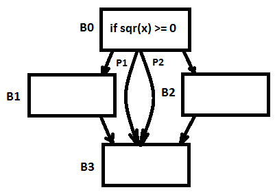
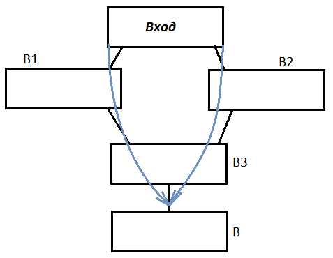

# Название задачи: создание парсера языка программирования

### Выполнено командой: YACT

### Постановка задачи: 

Необходимо создать парсер языка программирования, используемого для реализации и демонстрации различных оптимизаций. В качестве генератора парсера был использован GPPG. Он генерирует bottom-up парсер, распознающий LALR(1) языки с традиционной системой устранения неоднозначности yacc. 

Синтасические конструкции языка программирования зафиксированы в документе [language-syntax.md](https://github.com/wisestump/OptimizingCompiler/blob/master/docs/language-syntax.md)

### От каких проектов зависит:

  - GPPG

### Зависимые проекты:

  - Алгоритмы анализа потоков данных

### Теория

В данном разделе рассматриваются две составляющие алгоритма парсинга: лексер и парсер.

#### Лексер

Лексер предназначен для разбиения входного потока символов на *лексемы* - отдельные, осмысленные единицы программы. В данной реализации лексер выполняет следующие функции:

- Выделение идентификаторов и целых чисел
- Выделение символьных токенов (>, <=, & и т.п.)
- Выделение ключевых слов
- Формирование текста синтаксической ошибки

Исходный код лексера назодится в файле [SimpleLex.lex](https://github.com/wisestump/OptimizingCompiler/blob/master/src/gppgparser/SimpleLex.lex)

#### Парсер

Парсер принимает на вход поток лексем и формирует *абстрактное синтаксическое дерево* (AST). В данной реализации были использованы следующие типы для термов:

- *SyntaxNode* в качестве базового узла синтаксического дерева
- *Statement* - для узлов, представляющих оператор
- *Expression* - для узлов, представляющих выражение
- *String* - для метки оператора

Исходный код парсера находится в файле [SimpleYacc.y](https://github.com/wisestump/OptimizingCompiler/blob/master/src/gppgparser/SimpleYacc.y)
### Входные данные:
 - Текст программы на языке, описаном в [language-syntax.md](https://github.com/wisestump/OptimizingCompiler/blob/master/docs/language-syntax.md)

### Выходные данные:
 - Синтаксическое дерево 

### Используемые структуры данных

- `List<T>` - для хранения списка потомков узла синтаксического дерева

### Реализация алгоритма

Формирование синтаксического дерева происходит в действиях, совершаемых парсером в файле [SimpleYacc.y](https://github.com/wisestump/OptimizingCompiler/blob/master/src/gppgparser/SimpleYacc.y). Например, формирование списка операторов выглядит следующим образом:
``` 
stlist	: statement
	{ 
		$$ = new StatementList($1); 
	}
	| stlist statement
	{
		$$ = ($1 as StatementList).Add($2); 
	}
	;
```

Иерархия синтаксических узлов:


### Пример использования

``` C#
string text = @"
a = 40;
b = a + 2;
print(b);";
SyntaxNode root = ParserWrap.Parse(text);
Console.WriteLine(root == null ? "Ошибка" : "Программа распознана");
if (root != null)
{
    var prettyPrintedProgram = PrettyPrinter.CreateAndVisit(root).FormattedCode;
    Console.WriteLine(prettyPrintedProgram);
}
```
Вывод:

```
a = 40;
b = a + 2;
print(b);
```

### Тест
``` C#
string text = @"
a = 40;
b = a + 2;
print(b);";
SyntaxNode root = ParserWrap.Parse(text);

var statements = new StatementList();
statements.Add(new AssignmentStatement(new Identifier("a"), new Int32Const(40)));
statements.Add(new AssignmentStatement(
    new Identifier("b"),
    new BinaryExpression(
        new Identifier("a"),
        Operation.Add,
        new Int32Const(2))));
statements.Add(new PrintStatement(new Identifier("b"), false));
Assert.AreEqual(root, new Program(statements));
```
 
# Название задачи: генерация трехадресного кода по синтаксическому дереву

### Выполнено командой: YACT

### Постановка задачи: 

Необходимо релизовать генератор трехадресного кода по синтаксическому дереву. Трехадресный код состоит из семи видов инструкций:

- `x = y op z`
- `x = y`
- `x = op z`
- `goto L`
- `if x goto  L`
- `no-op`
- `print`

### От каких проектов зависит:

  - Синтаксическое дерево

### Зависимые проекты:

  - Базовые блоки

### Теория

Перевод синтаксических конструкций в трехадресный код может быть выполнен следующим образом:

- Бинарные выражения сохраняются в отдельных, генерируемых переменных (`t0`, `t1`, ...)
- Присваивания унарных выражения переводятся напрямую
- Присваивания бинарных выражений преобразуются в присваивания унарных с использованием правил преобразования бинарных выражений
- Циклы и условный оператор могут быть преобразованы с использованием условных/безусловных операторов перехода и пустых операций с метками

### Входные данные:
 - Синтаксическое дерево

### Выходные данные:
 - Список команд трехадресного кода

### Используемые структуры данных

- `List<T>` - для хранения списка команд
- `Stack<T>` - для хранения выражений при преобразовании бинарных выражений

### Реализация алгоритма

Генератор трехадресного кода был выполнен с использованием паттерна *визитор*. Для каждого узла синтаксического дерева были определены методы его обработки и в них осуществлялось формирование трехадресных команд.

Исходный код генератора расположен в [ThreeAddressCodeGenerator.cs](https://github.com/wisestump/OptimizingCompiler/blob/master/src/DataFlowAnalysis/IntermediateRepresentation/ThreeAddressCode/ThreeAddressCodeGenerator.cs)

Иерархия трехадресных команд


### Пример использования

``` C#
text = @"
a = 1;
b = 1;
c = a + b;
for i = 1 .. 3
    c = c - 1;
";
SyntaxNode root = ParserWrap.Parse(text);
if (root != null)
{
    var tac = ThreeAddressCodeGenerator.CreateAndVisit(root);
    Console.WriteLine(string.Join(Environment.NewLine, tac.Program.Commands.Select(x => x.ToString())));
}
```

Вывод:
```
a = 1
b = 1
t0 = a + b
c = t0
i = 1
$GL_1: goto $GL_2 if i > 3
t1 = c - 1
c = t1
i = i + 1
goto $GL_1
$GL_2: <no-op>
```

### Тест
``` C#
string text = @"
a = 2;
while a > 1
a = a - 1;";
SyntaxTree.SyntaxNodes.SyntaxNode root = ParserWrap.Parse(text);
var threeAddressCode = ThreeAddressCodeGenerator.CreateAndVisit(root).Program;

var expectedCommands = new List<ThreeAddressCommand>
{
    new Assignment("a", new Int32Const(2)),
    new Assignment("t0", new BinaryOperation("a", Operation.Greater, 1)),
    new ConditionalGoto("$GL_2", new BinaryOperation("t0", Operation.Equal, 0)) { Label = "$GL_1" },
    new Assignment("t1", new BinaryOperation("a", Operation.Subtract, 1)),
    new Assignment("a", new Identifier("t1")),
    new Goto("$GL_1"),
    new NoOperation("$GL_2")
};

CollectionAssert.AreEqual(threeAddressCode.Commands, expectedCommands);
``` 
# Вычисление множеств Use(B) и Def(B) для активных переменных

### Выполнено командой:
*PiedPiper (Бергер Анна, Колесников Сергей)*

### От каких проектов зависит:
1. Базовые блоки

### Зависимые проекты:
1. Итерационный алгоритм для активных переменных

### Теория
В точке p **x** является активной переменной, если существует путь, проходящий через p, начинающийся присваиванием, заканчивается
ее использованием и на всем промежутке нет других присваиваний переменной **x**.
 - Def(B) -- множество переменных, определенных в базовом блоке до любого их использования. 
 
 Можно использовать более простое определение Def(B) -- множество переменных, определенных в базовом блоке. При таком изменении определения
 результат работы итерационного алгоритма не изменится.
 - Use(B) -- множество переменных, определенных в базовом блоке до любого их определения.

### Входные данные:
 - Базовый блок (BasicBlock)

### Выходные данные:
 - Пара множеств Use(B) и Def(B)
 
 ### Используемые структуры данных
Dictionary<int, Tuple<ISet<string>, ISet<string>>> SetStorage - словарь, сопоставляющий номеру базового блока его пару его множеств Use(B) и Def(B)

 ### Реализация алгоритма
 
 Метод получения множеств Use(B) и Def(B) по базовому блоку. 
 Он сохраняет полученные множества в SetStorage для избежания повторных вычислений при повторном вызове для блока.
 ```C#
 public Tuple<ISet<string>, ISet<string>> GetDefUseSetsByBlock(BasicBlock block)
  {
    if (!SetStorage.Keys.Contains(block.BlockId))
    {
      SetStorage.Add(block.BlockId, CreateDefUseSets(block));
    }
    return SetStorage[block.BlockId];
  }
 ```
 Метод, проходящий по списку команд базового блока и заполняющий множества Use(B) и Def(B). 
 Множество Def(B) пополняется, если встретилась команда типа Assignment. 
 Для пополнения множества Use(B) вызывается вспомогательная функция ExpressionParser.
 ``` C#
 private Tuple<ISet<string>, ISet<string>> CreateDefUseSets(BasicBlock block)
  {
    ISet<string> Def = new HashSet<string>();
    ISet<string> Use = new HashSet<string>();

    foreach (var command in block.Commands)
    {
      if (command.GetType() == typeof(Assignment)) 
      {
        Def.Add(((Assignment)command).Target.Name);
        ExpressionParser(((Assignment)command).Value, Def, Use);
      }
      if (command.GetType() == typeof(ConditionalGoto))
      {
        ExpressionParser(((ConditionalGoto)command).Condition, Def, Use);
      }
      if (command.GetType() == typeof(Print))
      {
        ExpressionParser(((Print)command).Argument, Def, Use);
      }
    }
    return new Tuple<ISet<string>, ISet<string>>(Def, Use);
  }
 ```
 
 Рекурсивная функция, позволяющая обработать части выражений типа Expression и пополнить множество Use(B)
 ``` C#
 private void ExpressionParser(Expression expr, ISet<string> Def, ISet<string> Use)
  {
    if (expr.GetType() == typeof(BinaryOperation))
    {
      ExpressionParser(((BinaryOperation)expr).Left, Def, Use);
      ExpressionParser(((BinaryOperation)expr).Right, Def, Use);
    }
    if (expr.GetType() == typeof(Identifier))
    {
      if (!Def.Contains(((Identifier)expr).Name))
      {
        Use.Add(((Identifier)expr).Name);
      }
    }
    if (expr.GetType() == typeof(UnaryOperation))
    {
      ExpressionParser(((UnaryOperation)expr).Operand, Def, Use);
    }
  }
 ``` 
 ### Пример использования
 ```
 DefUseBlockCalculator DefUseCalc = new DefUseBlockCalculator();
 var UseDefTuple = DefUseCalc.GetDefUseSetsByBlock(block);
 var Def = UseDefTuple.Item1;
 var Use = UseDefTuple.Item2;
 ```
 
 ### Тест 
Программа:
```
a = 4;
b = 4;
c = a + b;
if 1
    a = 3;
else
    b = 2;
print(c);
```
Базовый блок BlockId = 0
```
Commands:
  a = 4
  b = 4
  t0 = a + b
  c = t0

Def(B) = {a, b, t0, c}
Use(B) = {}
```
Базовый блок BlockId = 3
```
Commands:
  $GL_1: <no-op>
  print c

Def(B) = {}
Use(B) = {c}
```
 
# Название задачи: Iterative Algorithm Parameter for DeadAliveVariables

### Выполнено командой: EndFrame (Аммаев Саид, Пирумян Маргарита)

### Постановка задачи: 
Необходимо реализовать класс, являющийся параметром обобщенного 
итерационного алгоритма. Класс должен наследоваться от абстрактного класса BasicIterativeAlgorithmParameters<V>, 
и в нём необходимо задать поля ForwardDirection, отвечающее за порядок обхода блоков, FirstValue, хранящее значение первого(последнего)
блока, StartingValue, хранящее начальное приближение всех блоков, а также методы GatherOperation, являющийся оператором сбора, и 
TransferFunction, являющийся передаточной функцией.


### От каких проектов зависит:

  - BasicIterativeAlgorithmParameters
  - SetIterativeAlgorithmParameters
  - BasicBlock
  - DefUseBlockCalculator

### Зависимые проекты:

  - IterativeAlgorithm

### Теория

> Переменная x - активная в точке p, если существует путь, проходящий через p, начинающийся присваиванием и заканчивающийся
ее использованием, и на всем промежутке нет других присваиваний переменной x.
defB - множество переменных, определенных в B до любого их использования
useB - множество переменных, использующихся в B до любого их определения.
fB - передаточная функция для блока B.
fB(OUT[B]) = IN[B].
IN[B] = useB U (OUT[B] - defB).

### Входные данные:

### Выходные данные:
 - DeadAliveIterativeAlgorithmParameters : SetIterativeAlgorithmParameters<string>

### Используемые структуры данных

 - IEnumerable<ISet<string>> blocks - множество переменных
 - BasicBlock block - базовый блок
 - ISet<string> input - IN[B]

### Реализация алгоритма
```C#
    public class DeadAliveIterativeAlgorithmParameters : SetIterativeAlgorithmParameters<string>
    {
        public override ISet<string> GatherOperation(IEnumerable<ISet<string>> blocks)
        {
            ISet<string> union = SetFactory.GetSet((IEnumerable<string>)blocks.First());
            /* U(по всем потомкам) IN[B] */
            foreach (var block in blocks.Skip(1))
            {
                union.UnionWith(block);
            }
            return union;
        }
        public override ISet<string> GetGen(BasicBlock block)
        {
            /* Gen == Use */
            DefUseBlockCalculator DefUseCalc = new DefUseBlockCalculator();
            return DefUseCalc.GetDefUseSetsByBlock(block).Item2;
        }
        public override ISet<string> GetKill(BasicBlock block)
        {
            /* Kill = Def */
            DefUseBlockCalculator DefUseCalc = new DefUseBlockCalculator();
            return DefUseCalc.GetDefUseSetsByBlock(block).Item1;
        }
        public override ISet<string> TransferFunction(ISet<string> input, BasicBlock block)
        {
            /* useB U (input \ defB) */
            return SetFactory.GetSet(GetGen(block).Union(input.Except(GetKill(block))));
        }
        /* Направление вверх */
        public override bool ForwardDirection { get { return false; } } 
        /* OUT[Выход] := пустое множество */
        public override ISet<string> FirstValue { get { return SetFactory.GetSet<string>(); } }
        /* Начальное приближение - пустое множество */
        public override ISet<string> StartingValue { get { return SetFactory.GetSet<string>(); } }
```
### Пример использования
```
SyntaxNode root = ParserWrap.Parse(text);
Graph graph = new Graph(BasicBlocksGenerator.CreateBasicBlocks(ThreeAddressCodeGenerator.CreateAndVisit(root).Program));
var deadAliveVars = IterativeAlgorithm.Apply(graph, new DeadAliveIterativeAlgorithmParameters());
```
### Тест
```
   a = 2;
   b = 3;
1: c = a + b;
2: a = 3; 
   b = 4;
3: c = a;
```
```
OUT[0] = {a, b}
OUT[1] = {}
OUT[2] = {a}
OUT[3] = {}
```
 
# Передаточная функция для задачи распространения констант

### Выполнено командой:
*EndFrame (Аммаев Саид,  Пирумян Маргарита)*

### Постановка задачи:
Необходимо реализовать функцию для задачи распространения констант.

### От каких проектов зависит:
1. Трехадресного кода
2. Базового блока

### Зависимые проекты:
1. Итерационный алгоритм

### Теория
```
После применения передаточной функции к значению потока данных получаются новые.

Поток данных - m
Новое значение потока данных - m'
Свойства значения потока данных и  правила вычисления передаточной функции:
1. m1 ^ m2 = m <=> m1(v) ^ m2(v) = m(v), для любых v
2. m1 < m2 <=> m1(v) < m2(v) , для любых v
  fs(m) = m', где s - команда трехадресного кода
  2.1. если s - не  присваивание, то m' = m
  2.2. если s - присваивание, то для любого v != x : m'(v) = m(v)
3. если v = x
  3.1. x := c
      m'(x) = c
  3.2. x := y + z
      m'(x) = m(y) + m(z), если m(y) и m(z) - const
      m'(x) = NAC, если m(y) или m(z) - NAC
      m'(x) = UNDEF - в остальных случаях
  3.3. x := f(...), где f - оператор вызова функции
      m'(x) = NAC
```

### Входные данные:
 - Dictionary<string, string> input - значение потока данных
 - BasicBlock block - базовый блок(ББЛ)
 - int commandNumber - номер команды в ББЛ

### Выходные данные:
 - Dictionary<string, string> - новое значение потока данных

 ### Реализация алгоритма:

 ``` C#
 /* реализация передаточной функции в классе
 public class ConstantsPropagationParameters : CompositionIterativeAlgorithmParameters<Dictionary<string, string>> */
 
 public override Dictionary<string, string> CommandTransferFunction(Dictionary<string, string> input, BasicBlock block, int commandNumber)
        {
            //получение команды по номеру из ББЛ
            ThreeAddressCommand command = block.Commands[commandNumber];
            //если присваивание
            if (command.GetType() == typeof(Assignment))
            {
                string newValue = NAC;
                Expression expr = (command as Assignment).Value;
                if (expr.GetType() == typeof(Int32Const) || expr.GetType() == typeof(Identifier))
                    newValue = getConstantFromSimpleExpression(input, (expr as SimpleExpression));
                //если унарная операция
                else if (expr.GetType() == typeof(UnaryOperation))
                {
                    UnaryOperation operation = (expr as UnaryOperation);
                    newValue = calculateVal(getConstantFromSimpleExpression(input, operation.Operand), operation.Operation);
                }
                //если бинарная операция
                else if (expr.GetType() == typeof(BinaryOperation))
                {
                    BinaryOperation operation = (expr as BinaryOperation);
                    newValue = calculateVal(getConstantFromSimpleExpression(input, operation.Left), getConstantFromSimpleExpression(input, operation.Right), operation.Operation);
                }
                string leftOperand = (command as Assignment).Target.Name;
                input[leftOperand] = newValue;
            }
            //если не присваивание, вернется входной поток данных
            return input;
        }
        
        //вспомогательная функция, которая возвращает константу по значению входного потока данных и выражению
        string getConstantFromSimpleExpression(Dictionary<string, string> input, SimpleExpression expr)
        {
            string result = NAC;
            if (expr.GetType() == typeof(Int32Const))
                result = (expr as Int32Const).ToString();
            else if (expr.GetType() == typeof(Identifier))
            {
                string var = (expr as Identifier).ToString();
                if (!input.ContainsKey(var))
                    input[var] = UNDEF;
                result = input[var];
            }
            return result;
        }

        ...
}
 ``` 
 
 //вспомогательные функции calculateVal реализованы другой командой

### Пример использования
```C#
   Dictionary<string, string> m = new Dictionary(/* ... */);
   BasicBlock block = new BasicBlock(/*...*/);
   Dictionary<string, string> m2 = CommandTransferFunction(m, block, 0)
```

### Тест
Программа
```cs 
x = y + z;
```

```
m: x = UNDEF; y = "2"; z = "3";
m': x = "5"; y = "2"; z = "3";
```

 
# Базовые блоки и алгоритм их получения.

### Выполнено командой:
*EndFrame (Аммаев Саид,  Пирумян Маргарита)*

### Постановка задачи:
Необходимо реализовать класс Базовый блок(ББЛ).
Необходимо реализовать класс Список Базовых блоков.
Необходимо реализовать алгоритм построения списка ББЛ по имеющемуся списку трехадресных команд.

### От каких проектов зависит:
1. Трехадресного кода 

### Зависимые проекты:
1. Граф управления потока

### Теория
Базовый блок(ББЛ) - максимальная последовательность, идущих друг за другом команд, удовлетворяющий мледующим свойствам:
1. Поток управления может входить в блок только через первую команду;
2. Управление покидает блок без останова или ветвления за исключением, возможно, последней команды.

Алгоритм нахождения:
1. Определить команды-лидеры:
        - первая команда программы;
        - любая команда, на которую есть переход;
        - любая команда, следующая за командой перехода;
2. Сформировать ББЛ - набор команд от лидера до лидера.(первый включается, второй нет)

### Входные данные:
 - Объект класса Program из ThreeAddressCode.Model, в котором хранится список трехадресных команд (program)

### Выходные данные:
 - Список базовых блоков (BasicBlocksList)

 ### Используемые структуры данных:
 - BasicBlock - класс ББЛ (созданный нами класс)
 - BasicBlocksList - класс списка ББЛ (созданный нами класс)
 
 - BasicBlocksList basicBlocks - список ББЛ
 - List<ThreeAddressCommand> commands - список трехадресных команд (ThreeAddressCommand структура из ThreeAddressCode.Model)
 - Dictionary<string, int> labels - словарь соответствия команды в трехадресном коде и метки, присвоенной ей
 - List<int> firstCommandsOfBlocks  - список для номеров комманд, являющимися первыми в ББЛ
 - List<int> lastCommandsOfBlocks - список для номеров комманд, являющимися последними в ББЛ
 - int[] BlockByFirstCommand - соответствие номера блока номеру команды в трехадресном коде, которая является первой командой в ББЛ 
 - int[] BlockByLastCommand - соответствие номера блока номеру команды в трехадресном коде, которая является последней командой в ББЛ
 - List<int>[] PreviousBlocksByBlockID - список номеров блоков, входящих в каждый ББЛ
 - List<int>[] NextBlocksByBlockID - списко номеров блоков, исходящих из каждого ББЛ
            
 ### Реализация алгоритма:

 ``` C#
 // построение списка ББЛ по списку трхадресных команд
public static BasicBlocksList CreateBasicBlocks(Program program)
        {
            BasicBlocksList basicBlocks = new BasicBlocksList();
            List<ThreeAddressCommand> commands = program.Commands;
            Dictionary<string, int> labels = new Dictionary<string, int>();
            List<int> firstCommandsOfBlocks = new List<int>(); 
            List<int> lastCommandsOfBlocks = new List<int>();

            //поиск команд-лидеров и присваивание меток всем коммандам(labels) 
            
            //первая комманда в программе
            firstCommandsOfBlocks.Add(0);
            for (int i = 0; i < commands.Count; ++i)
            {
                ThreeAddressCommand currentCommand = commands[i];
                //если есть метка в трехадресном коде
                if (currentCommand.Label != null)
                {
                    labels[currentCommand.Label] = i;
                    //если не первая команда в программе
                    if (i > 0)
                    {
                        //команда с меткой
                        firstCommandsOfBlocks.Add(i);
                        //команда предшествующая команде с меткой
                        lastCommandsOfBlocks.Add(i - 1);
                    }
                }
                //если есть переход
                if (currentCommand is Goto && i < commands.Count - 1)
                {
                    //следующая команда за командой перехода
                    firstCommandsOfBlocks.Add(i + 1);
                    //сама команда перехода
                    lastCommandsOfBlocks.Add(i);
                }
            }
            lastCommandsOfBlocks.Add(commands.Count - 1);
            firstCommandsOfBlocks = firstCommandsOfBlocks.Distinct().ToList();
            lastCommandsOfBlocks = lastCommandsOfBlocks.Distinct().ToList();

            int[] BlockByFirstCommand = new int[commands.Count];
            int[] BlockByLastCommand = new int[commands.Count];
            for (int i = 0; i < firstCommandsOfBlocks.Count; ++i)
                BlockByFirstCommand[firstCommandsOfBlocks[i]] = i;
            for (int i = 0; i < lastCommandsOfBlocks.Count; ++i)
                BlockByLastCommand[lastCommandsOfBlocks[i]] = i;

            List<int>[] PreviousBlocksByBlockID = new List<int>[commands.Count];
            List<int>[] NextBlocksByBlockID = new List<int>[commands.Count];
            for (int i = 0; i < commands.Count; ++i)
            {
                PreviousBlocksByBlockID[i] = new List<int>();
                NextBlocksByBlockID[i] = new List<int>();
            }

            //формирование списков номеров блоков, входящих и исходящих из каждого ББЛ
            foreach (var currentNumOfLastCommand in lastCommandsOfBlocks)
            {
                ThreeAddressCommand currentCommand = commands[currentNumOfLastCommand];
                int numOfCurrentBlock = BlockByLastCommand[currentNumOfLastCommand];
                if ((currentCommand.GetType() != typeof(Goto)) && (currentNumOfLastCommand < commands.Count - 1))
                {
                    int numOfNextBlock = numOfCurrentBlock + 1;
                    NextBlocksByBlockID[numOfCurrentBlock].Add(numOfNextBlock);
                    PreviousBlocksByBlockID[numOfNextBlock].Add(numOfCurrentBlock);
                }
                if (currentCommand is Goto)
                {
                    int numOfNextBlock = BlockByFirstCommand[labels[(currentCommand as Goto).GotoLabel]];
                    NextBlocksByBlockID[numOfCurrentBlock].Add(numOfNextBlock);
                    PreviousBlocksByBlockID[numOfNextBlock].Add(numOfCurrentBlock);
                }
            }
            
            //добавление команд в каждый ББЛ
            for (int i = 0; i < firstCommandsOfBlocks.Count; ++i)
            {
                BasicBlock block = new BasicBlock();
                block.Commands = new List<ThreeAddressCommand>(commands.Take(lastCommandsOfBlocks[i] + 1).Skip(firstCommandsOfBlocks[i]).ToList());
                basicBlocks.Blocks.Add(block);
                basicBlocks.BlockByID[block.BlockId] = block;
            }

            //добавление полученных списков входящих и исходящих ББЛ в каждый блок
            for (int i = 0; i < basicBlocks.Count(); ++i)
            {
                for (int j = 0; j < PreviousBlocksByBlockID[i].Count; ++j)
                    PreviousBlocksByBlockID[i][j] = basicBlocks.Blocks[PreviousBlocksByBlockID[i][j]].BlockId;
                for (int j = 0; j < NextBlocksByBlockID[i].Count; ++j)
                    NextBlocksByBlockID[i][j] = basicBlocks.Blocks[NextBlocksByBlockID[i][j]].BlockId;
                basicBlocks.Blocks[i].InputBlocks.AddRange(PreviousBlocksByBlockID[i]);
                basicBlocks.Blocks[i].OutputBlocks.AddRange(NextBlocksByBlockID[i]);
            }

            return basicBlocks;
        }	
        ...
}
 ``` 

### Пример использования
```
...
var b = BasicBlocksGenerator.CreateBasicBlocks(threeAddressCode);
...
```
### Тест
Программа
```cs 
b = 1;
if 1
  b = 3;
else
  b = 2;
```

Список базовых блоков 
```
BlockId = 0
Commands:
   b = 1
   goto $GL_2 if 1 == 0
InputBlocksNumbers = {}
OutputBlocksNumbers = {1; 2}
BlockId = 1
Commands:
   b = 3
   goto $GL_1
InputBlocksNumbers = {0}
OutputBlocksNumbers = {3}
BlockId = 2
Commands:
   $GL_2: <no-op>
   b = 2
InputBlocksNumbers = {0}
OutputBlocksNumbers = {3}
BlockId = 3
Commands:
   $GL_1: <no-op>
InputBlocksNumbers = {1; 2}
OutputBlocksNumbers = {}
```

 
# Построение графа потока управления CFG (Control Flow Graph)

### Выполнено командой:
*PiedPiper (Бергер Анна, Колесников Сергей)*

### От каких проектов зависит:
1. Базовые блоки 

### Зависимые проекты:
1. Построение трехадресного кода по графу потока управления
2. Итерационный алгоритм (и вспомогательные алгоритмы для его работы)
3. Построение дерева доминаторов

### Теория

**Граф потока управления** -- множество всех возможных путей исполнения программы, представленное в виде графа. В графе потока управления каждый узел  графа соответствует базовому блоку. Ребро из блока В в блок С идет тогда и только тогда, когда первая команда блока С может следовать непосредственно за последней командой блока В. Тогда говорим, что В -- предшественник С, а С -- преемник В.

Зачастую к графу добавляются два узла, именуемые входом и выходом и не соответствующие выполнимым промежуточным командам. Существует ребро от входа к первому выполнимому узлу графа, т.е. к базовому блоку, который начинается с первой команды промежуточного кода. Если последняя команда программы не является безусловным переходом, то выходу предшествует блок, содержащий эту последнюю команду программы. В противном случае таковым предшествующим блоком является любой базовый блок, имеющий переход к коду, не являющемуся частью программы. 

### Входные данные:
 - Список базовых блоков (BasicBlocksList)

### Выходные данные:
 - Граф потока управления (Graph)

 ### Используемые структуры данных
 - BidirectionalGraph<BasicBlock, Edge<BasicBlock>> - граф потока управления (структура данных из пакета QuickGraph)
 - Dictionary<int, BasicBlock> blockMap - соответствие между узлами графа и уникальными идентификаторами базовых блоков (blockId)

 ### Реализация алгоритма

 ``` C#
 // построение графа потока управления по списку базовых блоков
public Graph(BasicBlocksList listBlocks)
{
	CFG.AddVertexRange(listBlocks.Blocks);

	foreach (BasicBlock block in listBlocks.Blocks)
	{
		blockMap.Add(block.BlockId, block);
	}

	foreach (var block in listBlocks.Blocks)
	{
		foreach (var numIn in block.InputBlocks)
		{
			CFG.AddEdge(new Edge<BasicBlock>(this.getBlockById(numIn), block));
		}
	}
	...
}
 ``` 
 Для удобства использования графа в нем реализованы следующие методы:
 - public BasicBlock getBlockById(int id) -- по идентификатору базового блока возвращается базовый блок - узел графа
 - public BasicBlocksList getChildren(int id) -- по идентификатору базового блока возвращается список базовых блоков-преемников
 - public BasicBlocksList getParents(int id) -- по идентификатору базового блока возвращается список базовых блоков-предшественников
 - BasicBlock getRoot() -- точка входа в программу
 - public int GetCount() -- количество вершин в графе
 - public IEnumerable<Edge<BasicBlock>> GetEdges() -- список ребер в графе
 - public IEnumerable<BasicBlock> GetVertices() -- список вершин в графе
 - public bool Contains(BasicBlock block) -- проверка, содержится ли базовый блок в графе
 - public bool IsAncestor(int id1, int id2) -- проверка является ли блок с blockId = id1


### Пример использования
```
...
var b = BasicBlocksGenerator.CreateBasicBlocks(threeAddressCode);
Graph g = new Graph(b);
...
```
### Тест
Программа
```cs 
b = 1;
if 1
  b = 3;
else
  b = 2;
```

Список базовых блоков 
```
BlockId = 0
Commands:
   b = 1
   goto $GL_2 if 1 == 0
InputBlocksNumbers = {}
OutputBlocksNumbers = {1; 2}
BlockId = 1
Commands:
   b = 3
   goto $GL_1
InputBlocksNumbers = {0}
OutputBlocksNumbers = {3}
BlockId = 2
Commands:
   $GL_2: <no-op>
   b = 2
InputBlocksNumbers = {0}
OutputBlocksNumbers = {3}
BlockId = 3
Commands:
   $GL_1: <no-op>
InputBlocksNumbers = {1; 2}
OutputBlocksNumbers = {}
```

Граф потока управления
```
0:
<-- 
-->  1 2
1:
<--  0
-->  3
2:
<--  0
-->  3
3:
<-- 1 2
--> 
```
 
# Название задачи: Построение трехадресного кода по CFG

### Выполнено командой: 
Yet yet another team(Горелов Антон, Кочерга Михаил)

### Постановка задачи: 
Требуется реализовать алгоритм, который по данному графу потока управления восстанавливает текст программы в трехадресном коде.

### От каких проектов зависит:

  - Граф управления потока(CFG)

### Зависимые проекты:

  - Отсутствует

### Теория

**Трехадресный код** - это последовательность операторов одного из следующих видов.
x = y op z
x = y //команды копирования
x = op y //x, y, z - имена, константы или временные объекты.
goto L
if x goto L
if x goto L
if False x goto L
**Трехадресный код** представляет собой линеаризованное представление синтаксического дерева или ориентированного ациклического графа, в котором явные имена соответствуют внутренним узлам графа. 


Ориентированный ациклический граф и  соответствующий ему трехадресный код.


### Входные данные:
 - Граф потока управления

### Выходные данные:
 - Трехадресный код.

### Используемые структуры данных

 - BidirectionalGraph<BasicBlock, Edge> - граф потока управления (структура данных из пакета QuickGraph)
 - Dictionary<int, BasicBlock> blockMap - соответствие между узлами графа и уникальными идентификаторами базовых блоков (blockId)
 - List<ThreeAddressCommand> - для хранения результата
 - Stack<BasicBlock> - для хранения порядка обработки ББл.
 - HashSet<BasicBlock> - для хранения обрабтанных ББл.

### Реализация алгоритма

```C#
public List<ThreeAddressCommand>  transformToThreeAddressCode()
         {
             var res = new List<ThreeAddressCommand>();
             var done = new HashSet<BasicBlock>();
             var stack = new Stack<BasicBlock>();
             stack.Push(getBlockById(0));
             BasicBlock cur = null;
 
             while (done.Count < this.GetCount())
             {
                 cur = stack.Pop();
                 done.Add(cur);
                 
                 foreach (var c in cur.Commands)  { res.Add(c); }
                 
                 switch (cur.OutputBlocks.Count)
                 {
                     case 0:
                         continue;
                      case 1:
                          //добавить в стек выходной ББЛ
                      case 2:
                          //если в else последний оператор goto, то добавить в стек ББл, на который указывает goto
                          //добавить в стек ветку else
                          //добавить в стек ветку if
                      default:
                          throw new Exception("There cannot be more than two output blocks!");
                }
            }
```

### Пример использования
```C#
SyntaxTree.SyntaxNodes.SyntaxNode root = ParserWrap.Parse(sourseText);
                var sourceThreeAddressCode = ThreeAddressCodeGenerator.CreateAndVisit(root).Program;
                BasicBlocksList bbl = BasicBlocksGenerator.CreateBasicBlocks(sourceThreeAddressCode);
                Graph cfg = new Graph(bbl);
                List<ThreeAddressCommand> resultThreeAddressCode = cfg.transformToThreeAddressCode();
```
### Тест

```C#
if 1
    if 1
    {
        a = 5;
        a = 1;
    }
    else
    {   
        for i = 1..5 
            a = 1;
    }
    
while 1
    a = 1;
a = 2;

for i = 1 .. 5
    for j = 1 .. 5
        a = 1;

for i = 1 .. 5
    for j = 1 .. 5
        if 1
            a = 1;
        else
        {   
            a = 1;
            a = 2;
        }
```
 
# Построение множества gen S и kill S для одной команды

### Выполнено командой:
*NoName (Скиба Кирилл, Борисов Сергей)*

### От каких проектов зависит:
1. Граф управления потока

### Зависимые проекты:
1. Вычисление передаточной функции, как композиции передаточных функций для одной команды
2. Множества gen B и kill B(на основе передаточной функции по явным формулам)

### Постановка задачи:
Необходимо реализовать алгоритм, вычисляющий множества *gen* и *kill* для одной команды

### Теория
Множеством *gen S* называется множество определений, генерируемых в базовом блоке *B*. Множеством *kill S* называется множество всех прочих определений той же переменной во всей остальной программе.

Эти множества входят в передаточную функцию для задачи о достигающих определениях, поэтому перед запуском итерационного алгоритма для нее необходимо вычислить эти множества для каждого блока,
а для этого нужно вычислить эти множества для каждой команды в этом блоке.

### Входные данные
- Базовый блок в котором содержится команда
- ID команды

### Выходные данные
- Множество gen
- Множество kill


### Используемые структуры данных
- `CommandNumber Gen` - множество gen (так как команда одна, то это номер этой команды)
- `ISet<CommandNumber>` - множество kill
- `Dictionary<string, ISet<CommandNumber>>` - хранилище команд
- `Graph graph` - граф потока управления


### Реализация

В реализации данного модуля был использован пакет NuGet QuickGraph.

```cs
// класс содержащий множества gen и kill.
public class GenKillOneCommand
{
    public CommandNumber Gen { get; set; }

    public ISet<CommandNumber> Kill { get; set; }

    public GenKillOneCommand(CommandNumber gen, ISet<CommandNumber> kill)
    {
        Gen = gen;
        Kill = kill;
    }
}

// Алгоритм построения множеств gen и kill
public class GenKillOneCommandCalculator
{
    private CommandNumber Gen;
    private ISet<CommandNumber> Kill;
    private Dictionary<string, ISet<CommandNumber>> CommandStorage;
    private Graph graph;

    public GenKillOneCommandCalculator(Graph g)
    {
        graph = g;
        CommandStorage = new Dictionary<string, ISet<CommandNumber>>();
        foreach (BasicBlock block in graph)
            for (int i = 0; i < block.Commands.Count(); i++)
            {
                var command = block.Commands[i];
                if (command.GetType() == typeof(Assignment))
                    if (CommandStorage.ContainsKey((command as Assignment).Target.Name))
                        CommandStorage[(command as Assignment).Target.Name].Add(new CommandNumber(block.BlockId, i));
                    else
                        CommandStorage.Add((command as Assignment).Target.Name,
                            SetFactory.GetSet(new CommandNumber(block.BlockId, i)));
            }
        Kill = SetFactory.GetSet<CommandNumber>();
    }

    public GenKillOneCommand CalculateGenAndKill(BasicBlock block, ThreeAddressCommand command)
    {
        Kill.Clear();
        if (command.GetType() == typeof(Assignment))
        {
            Gen = new CommandNumber(block.BlockId, block.Commands.IndexOf(command));
            string target = (command as Assignment).Target.Name;
            foreach (var c in CommandStorage[target])
                if (c.BlockId != block.BlockId && c.CommandId != block.Commands.IndexOf(command))
                    Kill.Add(new CommandNumber(c.BlockId, c.CommandId));
        }
        return new GenKillOneCommand(Gen, Kill);
    }

    public GenKillOneCommand CalculateGenAndKill(int blockId, int commandId)
    {
        var block = graph.getBlockById(blockId);
        return CalculateGenAndKill(block, block.Commands[commandId]);
    }

    public GenKillOneCommand CalculateGenAndKill(BasicBlock block, int commandId)
    {
        return CalculateGenAndKill(block, block.Commands[commandId]);
    }
}
```

### Пример использования
```cs
calculator = new GenKillOneCommandCalculator(g);
GenKillOneCommand genKill = calculator.CalculateGenAndKill(block, commandNumber);
```
 
# Построение множеств gen B и kill B (на основе передаточной функции по явным формулам)

### Выполнено командой:
*Ampersand (Золотарёв Федор, Маросеев Олег)*

### От каких проектов зависит:
1. Множества gen S и kill S для одной команды

### Зависимые проекты:
1. Итерационный алгоритм
2. Достигающие определения

### Постановка задачи:
В данной задаче требуется разработать класс, который реализует функции построения множеств Gen и Kill по входному графу потока. Вычисления множеств осуществляются на основе передаточной функции по явным формулам.

### Теория
Множество gen(B) - множество операций в блоке B. Множество kill(B) - множество остальных определений этих переменных в программе.

Формулы для построения множеств:
Gen(B) = gen[n] + ( gen[n-1] - kill[n] ) + ( gen[n-2] - kill[n-1] - kill[n]) + ... + (gen[1] - kill[2] - ... - kill[n])
Kill(B) = kill[1] + ... + kill[n]


### Используемые структуры данных
- `List<int> OutputBlocks` - номера выходных базовых блоков

### Реализация

```cs
class ExplicitTransferFunction : SetIterativeAlgorithmParameters<CommandNumber>
    {
        private GenKillOneCommandCalculator commandCalc;

        public ExplicitTransferFunction(Graph g)
        {
            commandCalc = new GenKillOneCommandCalculator(g);
        }

        public override ISet<CommandNumber> GatherOperation(IEnumerable<ISet<CommandNumber>> blocks)
        {
            ISet<CommandNumber> res = SetFactory.GetSet<CommandNumber>();
            foreach (var command in blocks)
                res.UnionWith(command);
            return res;
        }

        public override ISet<CommandNumber> GetGen(BasicBlock block)
        {
            //list of kill-sets for every command in block
            List<ISet<CommandNumber>> listKill = new List<ISet<CommandNumber>>(block.Commands.Count);
            foreach (var command in block.Commands)
                listKill.Add(commandCalc.CalculateGenAndKill(block, command).Kill);

            ISet<CommandNumber> genB = SetFactory.GetSet<CommandNumber>();

            for (int i = block.Commands.Count - 1; i >= 0; i--)
            {
                ISet<CommandNumber> genS = SetFactory.GetSet<CommandNumber>();
                genS.Add(commandCalc.CalculateGenAndKill(block, block.Commands[i]).Gen);
                for (int j = i; j < block.Commands.Count - 1; j++)
                {
                    genS.IntersectWith(listKill[i]);
                }
                genB.UnionWith(genS);
            }

            return genB;
        }

        public override ISet<CommandNumber> GetKill(BasicBlock block)
        {
            ISet<CommandNumber> killB = SetFactory.GetSet<CommandNumber>();
            foreach (var command in block.Commands)
                killB.UnionWith(commandCalc.CalculateGenAndKill(block, command).Kill);
            return killB;
        }
    }
```

### Пример использования

```cs
 public override ISet<Expression> TransferFunction(ISet<Expression> input, BasicBlock block)
        {
            var kill = GetKill(block).Cast<Identifier>();
            var result = SetFactory.GetSet(
                input.Where(inputExpression =>
                !kill.Any(inputExpression.HasIdentifiedSubexpression)));
            result.UnionWith(GetGen(block));

            return result;
            /*
             * Non-LINQ realization
            var difference = SetFactory.GetSet();
            var foundInKill = false;
            foreach (var inputExpression in input)
            {
                foreach (var killExpression in kill)
                {
                    if (!inputExpression.HasIdentifiedSubexpression(killExpression as Identifier))
                        continue;
                    foundInKill = true;
                    break;
                }
                if (!foundInKill)
                    difference.Add(inputExpression);
                foundInKill = false;
            }
            return SetFactory.GetSet(GetGen(block).Union(difference));
            */
        }
```
 
# Вычисление передаточной функции, как композиции передаточных функций для одной команды

### Выполнено командой: 
*Google Dogs (Александр Василенко, Кирилл Куц)*

### От каких проектов зависит:
1. Получение базовых блоков
2. Получение множеств *gen* и *kill* для одной команды

### Зависимые проекты:

1. Итерационный алгоритм для достигающих определений

### Постановка задачи:
Используя множества *gen* и *kill* для одной команды, необходимо вычислить множества *gen* и *kill* для каждого блока.

### Теория

Предположим, что блок *В* состоит из инструкций *s*<sub>*1*</sub>, ..., *s*<sub>*n*</sub> в указанном порядке. Если *s*<sub>*1*</sub> — первая инструкция базового блока *В*, то IN[*В*] = IN[*s*<sub>*1*</sub>]. Аналогично, если *s*<sub>*n*</sub>— последняя инструкция базового блока *B*, то OUT[*B*] = OUT[*s*<sub>*n*</sub>]. Передаточная функция базового блока *B*, которую мы обозначим как *f*<sub>*B*</sub>, может быть получена как композиция передаточных функций инструкций базового блока. Пусть *f*<sub>*s*<sub>*i*</sub></sub> — передаточная функция для инструкции *s*<sub>*i*</sub>. Тогда *f*<sub>*B*</sub> = *f*<sub>*s*<sub>*n*</sub></sub> <font size="3" color="black" face="Arial">&#9675;</font> ...
<font size="3" color="black" face="Arial">&#9675;</font>
*f*<sub>*s*<sub>*2*</sub></sub><font size="3" color="black" face="Arial"> &#9675; </font>*f*<sub>*s*<sub>*1*</sub></sub>.

### Входные данные
- Базовые блоки

### Выходные данные
- Множества *gen* и *kill* для блока

### Используемые структуры данных
- ```GenKillOneCommandCalculator commandCalc``` - вычислитель 
 множеств *gen* и *kill* для одной команды
 
### Реализация алгоритма
```cs
public override ISet<CommandNumber> CommandTransferFunction
    (ISet<CommandNumber> input, BasicBlock block,
      int commandNumber)
{
    GenKillOneCommand genKill =
      calculator.CalculateGenAndKill(block, commandNumber);
    var result = SetFactory.GetSet<CommandNumber>(input);
    result.ExceptWith(genKill.Kill);
    result.UnionWith(genKill.Gen == null
      ? SetFactory.GetSet<CommandNumber>()
      : SetFactory.GetSet(genKill.Gen));
    return result;
}
```

### Пример использования
```cs
public override T TransferFunction
  (T input, BasicBlock block)
{
    return Enumerable.Range(0, block.Commands.Count)
      .Aggregate(input, (result, c) => 
         CommandTransferFunction(result, block, c));
}
``` 
# Итерационный алгоритм для доступных выражений

### Выполнено командой: 
*Google Dogs (Александр Василенко, Кирилл Куц)*

### От каких проектов зависит:
1. Построение базовых блоков
2. Построение трехадресного кода
3. Построение множеств *e_gen* и *e_kill*

### Зависимые проекты:
отсутствуют

### Постановка задачи
Написать класс-наследник общего итерационного алгоритма, переопределить методы для поиска доступных выражений

### Теория
Выражение *х* + *у* **доступно** (available) в точке *р*, если любой путь от входного узла к *р* вычисляет *х* + *у* и после последнего такого вычисления до достижения *р* нет последующих присваиваний переменным *х* и *у*. Когда речь идет о *доступных выражениях*, мы говорим, что блок уничтожает выражение *х* + *у*, если он присваивает (или может присваивать) *х* и *у* и после этого не вычисляет *х* + *у* заново. Блок генерирует выражение *х* + *у*, если он вычисляет *х* + *у* и не выполняет последующих переопределений *х* и *у*. 


Мы можем найти доступные выражения методом, напоминающим метод вычисления достигающих определений. Предположим, что *U* — "универсальное" множество всех выражений, появляющихся в правой части одной или нескольких инструкций программы. Пусть для каждого блока *В* множество IN[*В*] содержит выражения из *U*, доступные в точке непосредственно перед началом блока *B*, a OUT[*В*] — такое же множество для точки, следующей за концом блока *В*. Определим *e_gen*<sub>*B*</sub> как множество выражений, генерируемых *В*, a *e_kill*<sub>*B*</sub> — как множество выражений из *U*, уничтожаемых в *B*. Заметим, что множества IN, OUT, *e_gen* 
и *e_kill* могут быть представлены в виде битовых векторов. Неизвестные множества IN и OUT связаны друг с другом и с известными *e_gen* и *e_kill* следующими 
соотношениями: 

OUT[Вход] = <html>&#x2205;</html>

и для всех базовых блоков *В*, отличных от входного:

OUT[*В*] = *e_gen*<sub>*B*</sub> <html>&#8746;</html> (IN[*В*] - *e_kill*<sub>*B*</sub>)

IN[*В*] = <html>&#8745;</html> OUT[*P*], где *P* - предшественник *B*

### Реализация алгоритма
```cs
public AvailableExpressionsCalculator(Graph g)
{
    Graph = g;
}

public override ISet<Expression> GatherOperation
  (IEnumerable<ISet<Expression>> blocks)
{
    ISet<Expression> intersection = SetFactory.GetSet((IEnumerable<Expression>)blocks.First());
    foreach (var block in blocks.Skip(1))
      intersection.IntersectWith(block);
    return intersection;
}

public override ISet<Expression> GetGen(BasicBlock block)
{
    return SetFactory.GetSet(
        block.Commands
          .OfType<Assignment>()
          .Select(x => x.Value));
}

public override ISet<Expression> GetKill(BasicBlock block)
{
    return SetFactory.GetSet(
      block.Commands
        .OfType<Assignment>()
        .Select(x => x.Target as Expression));
}

public override ISet<Expression> TransferFunction
  (ISet<Expression> input, BasicBlock block)
{
    var kill = GetKill(block).Cast<Identifier>();
    var result = SetFactory.GetSet(
        input.Where(inputExpression =>
        !kill.Any(inputExpression.HasIdentifiedSubexpression)));
    result.UnionWith(GetGen(block));
    return result;
}

public override bool ForwardDirection => true;

public override ISet<Expression> FirstValue => SetFactory.GetSet();

public override ISet<Expression> StartingValue
{
    get
    {
        ISet<Expression> result = SetFactory.GetSet();
        foreach (BasicBlock b in Graph)
          foreach (ThreeAddressCommand c in b.Commands)
            if (c.GetType() == typeof(Assignment))
            {
                result.Add((c as Assignment).Value);
                result.Add((c as Assignment).Target);
            }
         return result;
    }
}
```

### Пример использования
```cs
var availableExprs = IterativeAlgorithm.Apply(g,
    new AvailableExpressionsCalculator(g));
var outExpressions = availableExprs.Out.Select(
    pair => $"{pair.Key}: {string.Join(", ", 
    pair.Value.Select(ex => ex.ToString()))}");
```

 
# Название задачи: вычисление `e_gen(b)` и `e_kill(b)` для доступных выражений

### Выполнено командой: YACT

### Постановка задачи: 

Необходимо по данному графу потока данных найти множества `e_gen` и `e_kill` для каждого базового блока. Эти данные используются алгоритмом анализа доступных выражений. 

### От каких проектов зависит:

  - CFG
  - Базовые блоки
  - Обобщенный итеративный алгоритм
  - Трехадресный код

### Зависимые проекты:

  - Анализатор доступных выражений

### Теория

**Доступные выражения** -- алгоритм анализа, определяющий для каждой точки в программе множество выражений, которые не требуется перевычислять. Такие выражения называются *доступными* в данной точке. Для того, чтобы быть доступными в точке программы, операнды выражения не должны быть изменены на любом пути от вхождения этого выражения до точки программы.


### Входные данные:
 - Базовый блок

### Выходные данные:
 - Множество выражений

### Используемые структуры данных

 - `HashSet<Expression>` -- множество выражений

### Реализация алгоритма

``` C#
// Метод получения множества Gen
public override ISet<Expression> GetGen(BasicBlock block)
{
    return SetFactory.GetSet( 
        block.Commands
            .OfType<Assignment>() // оставляем только присваивания 
            .Select(x => x.Value)); // из них берем правые части
}

// Метод получения множества Kill
public override ISet<Expression> GetKill(BasicBlock block)
{
    return SetFactory.GetSet(
        block.Commands
            .OfType<Assignment>() // оставляем только присваивания 
            .Select(x => x.Target as Expression)); // из них берем левые части
}
```

### Пример использования

Трехадресный код программы:
``` C#
1: <no-op>
t0 = a + b
x = t0
2: <no-op>
t1 = a * b
y = t1
3: <no-op>
t2 = a + 1
a = t2
```

Вызов алгоритма

``` C#
// ----
// фомирование графа g
// ----
...
var availableExprs = IterativeAlgorithm.Apply(g, new AvailableExpressionsCalculator(g));
var outExpressions = availableExprs.Out.Select(
    pair => $"{pair.Key}: {string.Join(", ", pair.Value.Select(ex => ex.ToString()))}");
```
Вывод `outExpressions`:
```
// Доступные выражения
0: a + b, t0
1: a + b, t0, a * b, t1
2: t0, t1, a + 1, t2
```
### Тест

``` C#
string programText = @"
a = 4;
b = 4;
c = a + b;
if 1 
  a = 3;
else
  b = 2;
print(c);
";

// Формирование CFG и вызов алгоритма
SyntaxNode root = ParserWrap.Parse(programText);
var threeAddressCode = ThreeAddressCodeGenerator.CreateAndVisit(root).Program;
var basicBlocks = BasicBlocksGenerator.CreateBasicBlocks(threeAddressCode);
Graph g = new Graph(basicBlocks);

var availableExprs = IterativeAlgorithm.Apply(g, new AvailableExpressionsCalculator(g));
var outExpressions = availableExprs.Out.Select(
    pair => $"{pair.Key}: {string.Join(", ", pair.Value.Select(ex => ex.ToString()))}");

// Сравнение с эталоном
int startIndex = availableExprs.Out.Keys.Min();
Assert.IsTrue(availableExprs.Out[startIndex]
    .SetEquals(
        new HashSet<Expression>(new Expression[]
        {
            new Int32Const(4),
            new BinaryOperation(new identifier("a"), Operation.Add, new identifier("b")),
            new identifier("t0")
        })));

Assert.IsTrue(availableExprs.Out[startIndex + 1]
    .SetEquals(
        new HashSet<Expression>(new Expression[]
        {
            new Int32Const(4),
            new Int32Const(3),
            new identifier("t0")
        })));

Assert.IsTrue(availableExprs.Out[startIndex + 2]
    .SetEquals(
        new HashSet<Expression>(new Expression[]
        {
            new Int32Const(4),
            new Int32Const(2),
            new identifier("t0")
        })));

Assert.IsTrue(availableExprs.Out[startIndex + 3]
    .SetEquals(
        new HashSet<Expression>(new Expression[]
        {
                new Int32Const(4),
                new identifier("t0")
        })));
```
 
# Итерационный алгоритм для задачи распространения констант

### Выполнено командой:
*Ampersand (Золотарёв Федор, Маросеев Олег)*

### От каких проектов зависит:
1. Общий итерационный алгоритм
2. Передаточная функция для задачи распостронения констант

### Постановка задачи:
Создать класс, реализующий итерационный алгоритм для задачи распостронения констант

### Теория
Распространение констант – хорошо известная проблема глобального анализа потока данных. Цель распространения констант состоит в обнаружении величин, которые являются постоянными при любом возможном пути выполнения программы, и в распространении этих величин так далеко по тексту программы, как только это возможно. Выражения, чьи операнды являются константами, могут быть вычислены на этапе компиляции. Поэтому использование алгоритмов распространения констант позволяет компилятору выдавать более компактный и быстрый код.

Исходный алгоритм:

∀ t ∈ tuples
  lattice(t) = T
  unvisited(t) = true


Visit all basic blocks B in the program
  Visit all tuples t within B
    if unvisited(t) then propagate(t)


propagate (tuple t)
  unvisited(t) = false
  if ssa_link(t) ≠ 0 then
     if unvisited(ssa_link(t))
        then propagate(ssa_link(t))
     lattice(t) = lattice(t) П lattice(ssa_link(t))
  endif
  if unvisited(left(t)) then propagate(left(t))
  if unvisited(right(t)) then propagate(right(t))
  case on type (t)
    constant C: lattice(t) = C
    arithmetic operation:
      if all operands have constant lattice value
        then lattice(t) = arithmetic result of lattice 
  values of operands
        else lattice(t) = ⊥
      endif
    store: lattice(t) = lattice(RHS)
    φ-function: lattice(t) = П of φ-arguments of t
    γ-function:
      if lattice(predicate) = C then
        lattice(t) = lattice value of γ-argument
  corresponding to C
        else lattice(t) = П of all γ-arguments of t
      endif
    μ-function: lattice(t) = ⊥
    η-function: lattice(t) = lattice(η-argument)
    default: lattice(t) = ⊥
  end case
end propagate

### Используемые структуры данных
- ` Dictionary<Edge<BasicBlock>, EdgeType>` - словарь классифицированных ребер

### Реализация

```cs
 public class ConstantPropagation : IOptimization
    {
        public Graph Apply(Graph graph)
        {
            var constants = IterativeAlgorithm.Apply(graph, new ConstantsPropagationParameters());

            return graph;
        }
    }
    
public class ConstantsPropagationParameters : CompositionIterativeAlgorithmParameters<Dictionary<string, string>>
    {
        public const string NAC = "NAC";
        public const string UNDEF = "UNDEF";

        public override bool ForwardDirection { get { return true; } }

        public override Dictionary<string, string> FirstValue { get { return new Dictionary<string, string>(); } }

        public override Dictionary<string, string> StartingValue { get { return new Dictionary<string, string>(); } }

        public override Dictionary<string, string> CommandTransferFunction(Dictionary<string, string> input, BasicBlock block, int commandNumber)
        {
            ThreeAddressCommand command = block.Commands[commandNumber];
            if (command.GetType() == typeof(Assignment))
            {
                string newValue = NAC;
                Expression expr = (command as Assignment).Value;
                if (expr.GetType() == typeof(Int32Const) || expr.GetType() == typeof(Identifier))
                    newValue = getConstantFromSimpleExpression(input, (expr as SimpleExpression));
                else if (expr.GetType() == typeof(UnaryOperation))
                {
                    UnaryOperation operation = (expr as UnaryOperation);
                    newValue = calculateVal(getConstantFromSimpleExpression(input, operation.Operand), operation.Operation);
                }
                else if (expr.GetType() == typeof(BinaryOperation))
                {
                    BinaryOperation operation = (expr as BinaryOperation);
                    newValue = calculateVal(getConstantFromSimpleExpression(input, operation.Left), getConstantFromSimpleExpression(input, operation.Right), operation.Operation);
                }
                string leftOperand = (command as Assignment).Target.Name;
                input[leftOperand] = newValue;
            }
            return input;
        }

        string getConstantFromSimpleExpression(Dictionary<string, string> input, SimpleExpression expr)
        {
            string result = NAC;
            if (expr.GetType() == typeof(Int32Const))
                result = (expr as Int32Const).ToString();
            else if (expr.GetType() == typeof(Identifier))
            {
                string var = (expr as Identifier).ToString();
                if (!input.ContainsKey(var))
                    input[var] = UNDEF;
                result = input[var];
            }
            return result;
        }

        public override bool AreEqual(Dictionary<string, string> t1, Dictionary<string, string> t2)
        {
            return t1.Count == t2.Count && t1.Keys.All(key => t2.ContainsKey(key) && t1[key] == t2[key]);
        }
        string calculateVal(string x1, Operation op)
        {
            return calculateVal(x1, "0", op);
        }
        
        string calculateVal(string x1, string x2, Operation op)
        {
            if (x1 == NAC || x2 == NAC)
                return NAC;
            else if (x1 == UNDEF || x2 == UNDEF)
                return UNDEF;
            else
            {
                int lx = int.Parse(x1);
                int rx = int.Parse(x2);
                return ArithmeticOperationCalculator.Calculate(op, lx, rx).ToString();
            }
        }
        string gatherVal(string x1, string x2)
        {
            if (x1 == x2 || x2 == UNDEF || x1 == NAC)
                return x1;
            else if (x1 == UNDEF || x2 == NAC)
                return x2;
            else
                return NAC;
        }
        public override Dictionary<string, string> GatherOperation(IEnumerable<Dictionary<string, string>> blocks)
        {
            return blocks.Aggregate(new Dictionary<string, string>(), (result, x) =>
            {
                foreach(KeyValuePair<string, string> pair in x)
                    result[pair.Key] = result.ContainsKey(pair.Key) ? gatherVal(result[pair.Key], pair.Value) : pair.Value;
                return result;
            });
        }
    }
```

### Пример использования

```cs
 [TestClass]
    public class ConstantPropagationIterativeAlgorithmTests
    {
        [TestMethod]
        public void ConstantsPropagation1()
        {
            string programText = @"
a = 4;
b = 4;
c = a + b;
if 1 
  a = 3;
else
  b = 2;
print(c);
";
            SyntaxNode root = ParserWrap.Parse(programText);
            var threeAddressCode = ThreeAddressCodeGenerator.CreateAndVisit(root).Program;
            Trace.WriteLine(threeAddressCode);

            var basicBlocks = BasicBlocksGenerator.CreateBasicBlocks(threeAddressCode);
            Trace.WriteLine(Environment.NewLine + "Базовые блоки");
            Trace.WriteLine(basicBlocks);

            Trace.WriteLine(Environment.NewLine + "Управляющий граф программы");
            Graph g = new Graph(basicBlocks);
            Trace.WriteLine(g);


            Trace.WriteLine(Environment.NewLine + "Распространение констант");
            var consts = IterativeAlgorithm.Apply(g, new ConstantsPropagationParameters());
            var outConsts = consts.Out.Select(
                pair => $"{pair.Key}: {string.Join(", ", pair.Value.Select(ex => ex.ToString()))}");

            foreach (var outInfo in outConsts)
            {
                Trace.WriteLine(outInfo);
            }

            int startIndex = consts.Out.Keys.Min();
            Assert.IsTrue(consts.Out[startIndex]["a"]=="4" &&
                consts.Out[startIndex]["b"] == "4" &&
                consts.Out[startIndex]["t0"] == "8" &&
                consts.Out[startIndex]["c"] == "8");

            Assert.IsTrue(consts.Out[startIndex + 1]["a"] == "3" &&
                consts.Out[startIndex + 1]["b"] == "4" &&
                consts.Out[startIndex + 1]["t0"] == "8" &&
                consts.Out[startIndex + 1]["c"] == "8");

            Assert.IsTrue(consts.Out[startIndex + 2]["a"] == "4" &&
                consts.Out[startIndex + 2]["b"] == "2" &&
                consts.Out[startIndex + 2]["t0"] == "8" &&
                consts.Out[startIndex + 2]["c"] == "8");

            Assert.IsTrue(consts.Out[startIndex + 3]["a"] == "NAC" &&
                consts.Out[startIndex + 3]["b"] == "NAC" &&
                consts.Out[startIndex + 3]["t0"] == "8" &&
                consts.Out[startIndex + 3]["c"] == "8");
        }

        [TestMethod]
        public void ConstantsPropagation2()
        {
            string programText = @"
    e=10;
    c=4;
    d=2;
    a=4;
    if 0
        goto 2;
    a=c+d;
    e=a;
    goto 3;
2:  a=e;
3:  t=0;
";
            SyntaxNode root = ParserWrap.Parse(programText);
            var threeAddressCode = ThreeAddressCodeGenerator.CreateAndVisit(root).Program;
            Trace.WriteLine(threeAddressCode);

            var basicBlocks = BasicBlocksGenerator.CreateBasicBlocks(threeAddressCode);
            Trace.WriteLine(Environment.NewLine + "Базовые блоки");
            Trace.WriteLine(basicBlocks);

            Trace.WriteLine(Environment.NewLine + "Управляющий граф программы");
            Graph g = new Graph(basicBlocks);
            Trace.WriteLine(g);
            
            Trace.WriteLine(Environment.NewLine + "Распространение констант");
            var consts = IterativeAlgorithm.Apply(g, new ConstantsPropagationParameters());
            var outConsts = consts.Out.Select(
                pair => $"{pair.Key}: {string.Join(", ", pair.Value.Select(ex => ex.ToString()))}");

            foreach (var outInfo in outConsts)
            {
                Trace.WriteLine(outInfo);
            }

            int startIndex = consts.Out.Keys.Min();
            Assert.IsTrue(consts.Out[startIndex]["a"] == "4" &&
                consts.Out[startIndex]["e"] == "10" &&
                consts.Out[startIndex]["d"] == "2" &&
                consts.Out[startIndex]["c"] == "4");

            Assert.IsTrue(consts.Out[startIndex + 1]["a"] == "4" &&
                consts.Out[startIndex + 1]["e"] == "10" &&
                consts.Out[startIndex + 1]["d"] == "2" &&
                consts.Out[startIndex + 1]["c"] == "4");

            Assert.IsTrue(consts.Out[startIndex + 2]["e"] == "6" &&
                consts.Out[startIndex + 2]["c"] == "4" &&
                consts.Out[startIndex + 2]["d"] == "2" &&
                consts.Out[startIndex + 2]["a"] == "6" &&
                consts.Out[startIndex + 2]["t0"] == "6");

            Assert.IsTrue(consts.Out[startIndex + 3]["a"] == "10" &&
                consts.Out[startIndex + 3]["e"] == "10" &&
                consts.Out[startIndex + 3]["d"] == "2" &&
                consts.Out[startIndex + 3]["c"] == "4");

            Assert.IsTrue(consts.Out[startIndex + 4]["e"] == "NAC" &&
                consts.Out[startIndex + 4]["c"] == "4" &&
                consts.Out[startIndex + 4]["d"] == "2" &&
                consts.Out[startIndex + 4]["t"] == "0" &&
                consts.Out[startIndex + 4]["t0"] == "6");
        }
    }
```
 
# Итерационный алгоритм

### Выполнено командой:
*Ampersand (Золотарёв Федор, Маросеев Олег)*

### От каких проектов зависит:
1. Граф управления потока

### Зависимые проекты:
1. Итерационный алгоритм для задачи распространения констант
2. Итерационный алгоритм для доступных выражений 
3. Итерационный алгоритм для активных переменных 

### Постановка задачи:
В данной задаче требуется разработать класс, который реализует общий итерационный алгоритм

### Теория
пока out(B) меняется {
    для каждого B - базового блока {
        in(B) = /\ out(p);// где p - непосредственно предшествующее
        out(B) = func(in(B));
    }
}

### Реализация

```cs
public static class IterativeAlgorithm
    {
        public static IterativeAlgorithmOutput<V> Apply<T, V>(Graph graph, BasicIterativeAlgorithmParameters<V> param) where T : BasicIterativeAlgorithmParameters<V>
        {
            IterativeAlgorithmOutput<V> result = new IterativeAlgorithmOutput<V>();

            foreach (BasicBlock bb in graph)
                result.Out[bb.BlockId] = param.StartingValue;

            bool changed = true;
            while (changed)
            {
                changed = false;
                foreach (BasicBlock bb in graph)
                {
                    result.In[bb.BlockId] = param.GatherOperation((param.ForwardDirection ? graph.getParents(bb.BlockId) : graph.getAncestors(bb.BlockId)).Blocks.Select(b => result.Out[b.BlockId]));
                    V newOut = param.TransferFunction(result.In[bb.BlockId], bb);
                    changed = changed || !param.Compare(result.Out[bb.BlockId], newOut);
                    result.Out[bb.BlockId] = param.TransferFunction(result.In[bb.BlockId], bb);
                }
            }
            if (!param.ForwardDirection)
                result = new IterativeAlgorithmOutput<V> { In = result.Out, Out = result.In };
            return result;
        }
    }
```

### Пример использования

```cs
 [TestClass]
    public class AvailableExpressionTest
    {
        [TestMethod]
        public void AvailableExpressionsTest()
        {
            string programText = @"
a = 4;
b = 4;
c = a + b;
if 1 
  a = 3;
else
  b = 2;
print(c);
";
            SyntaxNode root = ParserWrap.Parse(programText);
            var threeAddressCode = ThreeAddressCodeGenerator.CreateAndVisit(root).Program;
            Trace.WriteLine(threeAddressCode);

            var basicBlocks = BasicBlocksGenerator.CreateBasicBlocks(threeAddressCode);
            Trace.WriteLine(Environment.NewLine + "Базовые блоки");
            Trace.WriteLine(basicBlocks);

            Trace.WriteLine(Environment.NewLine + "Управляющий граф программы");
            Graph g = new Graph(basicBlocks);
            Trace.WriteLine(g);


            
            Trace.WriteLine(Environment.NewLine + "Доступные выражения");
            var availableExprs = IterativeAlgorithm.Apply(g, new AvailableExpressionsCalculator(g));
            var outExpressions = availableExprs.Out.Select(
                pair => $"{pair.Key}: {string.Join(", ", pair.Value.Select(ex => ex.ToString()))}");

            foreach (var outInfo in outExpressions)
            {
                Trace.WriteLine(outInfo);
            }

            int startIndex = availableExprs.Out.Keys.Min();
            Assert.IsTrue(availableExprs.Out[startIndex]
                .SetEquals(new Expression[]
                    {
                        new Int32Const(4),
                        new BinaryOperation(new identifier("a"), Operation.Add, new identifier("b")),
                        new identifier("t0")
                    }));

            Assert.IsTrue(availableExprs.Out[startIndex + 1]
                .SetEquals(new Expression[]
                    {
                        new Int32Const(4),
                        new Int32Const(3),
                        new identifier("t0")
                    }));

            Assert.IsTrue(availableExprs.Out[startIndex + 2]
                .SetEquals(
                    new Expression[]
                    {
                        new Int32Const(4),
                        new Int32Const(2),
                        new identifier("t0")
                    }));

            Assert.IsTrue(availableExprs.Out[startIndex + 3]
                .SetEquals(
                   new Expression[]
                   {
                       new Int32Const(4),
                       new identifier("t0")
                   }));
        }
    }
```
 
# Построение дерева доминаторов

### Выполнено командой:
*NoName (Скиба Кирилл, Борисов Сергей)*

### От каких проектов зависит:
1. Итерационный алгоритм
2. Граф управления потока

### Зависимые проекты:
1. Алгоритм классификации ребер графа

### Постановка задачи:
Необходимо создать класс для дерева доминаторов и построить это дерево, используя итеративный алгоритм.

### Теория
Узел *d* графа потока доминирует над узлом *n*, если любой путь от входного узла графа потока к *n* проходит через *d*.
При таком определении каждый узел доминирует над самим собой.

Дерево доминаторов - это дерево, в котором входной узел является корнем, а каждый узел *d* доминирует только над своими потомками в дереве.

Существование деревьев доминаторов следует из свойства доминаторов: каждый узел *n* имеет единственный непосредственный доминатор *m*, который является
последним доминатором *n* на любом пути от входного узла до *n*.

### Входные данные
- Граф потока управления

### Выходные данные
- Дерево доминаторов


### Используемые структуры данных
- `AdjacencyGraph<int, Edge<int>> Tree` - дерево доминаторов (структура данных из пакета NuGet QuickGraph)
- `Dictionary<int, int> Map` - словарь: номер базового блока - его непосредственный доминатор

### Реализация

В реализации данного модуля был использован пакет NuGet QuickGraph.

```cs
// класс "дерево доминаторов"
public class DominatorsTree : IEnumerable
{
    private AdjacencyGraph<int, Edge<int>> Tree = new AdjacencyGraph<int, Edge<int>>();
    private Dictionary<int, int> Map;

    public DominatorsTree(Graph g)
    {
        Map = ImmediateDominator.FindImmediateDominator(g);

        Tree.AddVertexRange(Map.Keys);

        foreach (int key in Map.Keys.Skip(1))
            Tree.AddEdge(new Edge<int>(Map[key], key));
    }

    public int GetParent(int id)
    {
        return Map[id];
    }

    public List<int> GetAncestors(int id)
    {
        return Map.Where(x => x.Value == id).Select(x => x.Key).ToList();
    }

    public override string ToString()
    {
        string res = "";
        foreach (var v in Tree.Vertices)
            if (Tree.OutEdges(v).Count() > 0)
                foreach (var e in Tree.OutEdges(v))
                    res += v + " --> " + e.Target + "\n";
        return res;
    }

    public IEnumerator GetEnumerator()
    {
        return Map.Values.GetEnumerator();
    }

    public Dictionary<int, int> GetMap()
    {
        return Map;
    }
}

// Класс "непосредственный доминатор"
public static class ImmediateDominator
{
    public static Dictionary<int, int> FindImmediateDominator(Graph g)
    {
        var _out = IterativeAlgorithm.IterativeAlgorithm.Apply(g, new DominatorsIterativeAlgorithmParametrs(g)).Out;

        int min = _out.Keys.Min();

        return _out.Select(x => new KeyValuePair<int, int>(x.Key,
                                        x.Key > min ? _out[x.Key].Take(_out[x.Key].Count - 1).Last() : min))
                                      .ToDictionary(x => x.Key, x => x.Value);
    }
}

// наследник общего класса "параметры итерационного алгоритма"
public class DominatorsIterativeAlgorithmParametrs : BasicIterativeAlgorithmParameters<ISet<int>>
{
    private Graph graph;

    public DominatorsIterativeAlgorithmParametrs(Graph g)
    {
        graph = g;
    }

    public override ISet<int> GatherOperation(IEnumerable<ISet<int>> blocks)
    {
        ISet<int> intersection = SetFactory.GetSet((IEnumerable<int>)blocks.First());
        foreach (var block in blocks.Skip(1))
            intersection.IntersectWith(block);

        return intersection;
    }

    public override ISet<int> TransferFunction(ISet<int> input, BasicBlock block)
    {
        return SetFactory.GetSet<int>(input.Union(new int[] { block.BlockId }));
    }

    public override bool AreEqual(ISet<int> t1, ISet<int> t2)
    {
        return t1.IsSubsetOf(t2) && t2.IsSubsetOf(t1);
    }

    public override ISet<int> StartingValue { get { return SetFactory.GetSet<int>(Enumerable.Range(graph.GetMinBlockId(), graph.Count())); } }

    public override ISet<int> FirstValue { get { return SetFactory.GetSet<int>(Enumerable.Repeat(graph.GetMinBlockId(), 1)); } }

    public override bool ForwardDirection { get { return true; } }

}

// Итеративный алгоритм, использующий для построения дерева доминаторов
public static IterativeAlgorithmOutput<V> Apply<V>(Graph graph, BasicIterativeAlgorithmParameters<V> param, int[] order = null)
{
    IterativeAlgorithmOutput<V> result = new IterativeAlgorithmOutput<V>();

    foreach (BasicBlock bb in graph)
        result.Out[bb.BlockId] = param.StartingValue;
    IEnumerable<BasicBlock> g = order == null ? graph : order.Select(i => graph.getBlockById(i));
    bool changed = true;
    while (changed)
    {
        changed = false;
        foreach (BasicBlock bb in g)
        {
            BasicBlocksList parents = param.ForwardDirection ? graph.getParents(bb.BlockId) : graph.getChildren(bb.BlockId);
            if (parents.Blocks.Count > 0)
                result.In[bb.BlockId] = param.GatherOperation(parents.Blocks.Select(b => result.Out[b.BlockId]));
            else
                result.In[bb.BlockId] = param.FirstValue;
            V newOut = param.TransferFunction(result.In[bb.BlockId], bb);
            changed = changed || !param.AreEqual(result.Out[bb.BlockId], newOut);
            result.Out[bb.BlockId] = param.TransferFunction(result.In[bb.BlockId], bb);
        }
    }
    if (!param.ForwardDirection)
        result = new IterativeAlgorithmOutput<V> { In = result.Out, Out = result.In };
    return result;
}
```

### Пример использования
```cs
DominatorsTree tree = new DominatorsTree(g);
foreach (Edge<BasicBlock> e in g.GetEdges())
{
    if (dfn[e.Source.BlockId] >= dfn[e.Target.BlockId])
        edgeTypes.Add(e, EdgeType.Retreating);
    else if (g.IsAncestor(e.Target.BlockId, e.Source.BlockId) && tree.GetParent(e.Target.BlockId) == e.Source.BlockId)
        edgeTypes.Add(e, EdgeType.Advancing);
    else
        edgeTypes.Add(e, EdgeType.Cross);
}
```

### Тест
```cs
*Программа*:
b = 1;
if 1 
  b = 3;
else
  b = 2;
```

*Граф потока управления*:


*Вывод программы*:

Формат вывода: "номер базового блока - его непосредственный доминатор"

0 -> 0                                                        
1 -> 0                                                          
2 -> 0                                                                
3 -> 0
 
## Построение глубинного остовного дерева

### Выполнено командой:
*PiedPiper (Бергер Анна, Колесников Сергей)*

### От каких проектов зависит:
1. Граф управления потока

### Зависимые проекты:
1. Нахождение естественных циклов

### Теория
Остовное дерево графа состоит из минимального подмножества рёбер графа, 
таких, что из любой вершины графа можно попасть в любую другую вершину, двигаясь по этим рёбрам.
Остовное дерево может быть построено практически любым алгоритмом обхода графа, например поиском 
в глубину или поиском в ширину. Оно состоит из всех пар рёбер ```(u,v)```, таких, 
что алгоритм, просматривая вершину ```u```, обнаруживает в её списке смежности новую, 
не обнаруженную ранее вершину ```v```. 

Поиск в графе в глубину (depth-first search) однократно посещает все узлы графа, начиная с входного узла и посещая, в первую 
очередь, насколько это возможно, узлы, максимально удаленные от входного. Путь поиска в глубину образует глубинное остовное дерево (охватывающее вглубь дерево) (depth-first spanning tree — DFST). Обход в прямом прядке посещает узел перед посещением любого из его дочерних узлов, которые затем рекурсивно посещаются в порядке слева направо. Обход в обратном порядке сначала рекурсивно слева направо посещает узлы, дочерние по отношению к текущему, а затем посещает сам текущий узел. 

### Входные данные:
 - Не требуются, остовное дерево строится в процессе построения CFG

### Выходные данные:
 - Ассоциативный массив <int, int>

### Реализация алгоритма
Узлы графа потока управления обходятся в прямом порядке и в процессе обхода нумеруются.
```cs
private void dfs(BasicBlock block, Dictionary<BasicBlock, bool> visited, ref int c)
{
  visited[block] = true;
  foreach (var node in getChildren(block.BlockId).Blocks)
  {
    if (!visited[node])
    {
      spanTree.AddEdge(new Edge<BasicBlock>(block, node));
      dfs(node, visited, ref c);
    }
  }
  spanTreeOrder[block.BlockId] = c;
  c--;
}
```
#### Пример использования
```cs
var b = BasicBlocksGenerator.CreateBasicBlocks(threeAddressCode);
Graph g = new Graph(b);
Dictionary<int, int> dfn = g.GetDFN();
```

### Тест
Программа:

```cs
b = 1;
if 1 
  b = 3;
else
  b = 2;
```

Управляющий граф программы
```
0:
<-- 
-->  1 2
1:
<--  0
-->  3
2:
<--  0
-->  3
3:
<--  1 2
--> 
```

Новое нумерование
```
3-->4
1-->3
2-->2
0-->1
```
 
# Классификация рёбер графа

### Выполнено командой: 
*Google Dogs (Александр Василенко, Кирилл Куц)*

### От каких проектов зависит:
1. Построение CFG
2. Построение дерева доминаторов
3. Построение глубинного остовного дерева

### Зависимые проекты:
1. Установить, все ли отступающие ребра являются обратными
2. Формирование последовательности областей в восходящем порядке

### Постановка задачи:
Необходимо классифицировать ребра графа потока управления на три вида:

1. *Наступающие* (advancing) ребра идут от узла *m* к истинным преемникам *m* в дереве.
2. *Отступающие* (retreating) ребра идут от узла *m* к предку *m* в дереве (возможно, к самому *m*).
3. *Поперечные* (cross) - все остальные ребра.

Пример:


Рёбра 1 <html>&rarr;</html> 3, 6 <html>&rarr;</html> 7, 9 <html>&rarr;</html> 10 являются наступающими, рёбра 4 <html>&rarr;</html> 3, 7 <html>&rarr;</html> 4, 8 <html>&rarr;</html> 3 являются отступающими, рёбра 2 <html>&rarr;</html> 3, 5 <html>&rarr;</html> 7 - поперечными.

### Теория

Все ребра, попадающие в глубинное остовное дерево, являются *наступающими*. В примере выше такие ребра отмечаются сплошной стрелкой. Однако, если бы на графе потока управления существовало ребро, например, 1 <html>&rarr;</html> 4, оно бы тоже считалось *наступающим*, несмотря на то, что не входило бы в DFST.

Ребро *m <html>&rarr;</html> n* является *отступающим* тогда и только тогда, когда *dfn*[*m*] <html>&ge;</html> *dfn*[*n*]. Если *m* является потомком *n* в глубинном остовном дереве, то *search*(*m*) завершается до *search*(*n*), поэтому *dfn*[*m*] <html>&ge;</html> *dfn*[*n*]. И наоборот, если *dfn*[*m*] <html>&ge;</html> *dfn*[*n*], то *search(*m*) завершается до *search*(*n*), или *m* = *n*. Но вызов *search*(*n*) должен начинаться до *search*(*m*), если существует ребро *m <html>&rarr;</html> n*, иначе тот факт, что *n* является преемником *m*, должен сделать *n* потомком *m* в DFST. Таким образом, время активности *search*(*m*) 
представляет собой подынтервал времени активности *search*(*т*), откуда следует, что *n* является предком *т* в DFST.

Важным свойством *поперечных* ребер является то, что если изобразить DFST так, чтобы дочерние узлы некоторого узла располагались слева направо в порядке, в котором они добавлялись в дерево, то все *поперечные* ребра будут идти справа налево. В нашем языке *поперечные* ребра могут быть получены только в случае, если на графе потока управления можно найти так называемый "ромб": то есть из одного базового блока можно попасть в другой (не непосредственный потомок первого) по двум и более путям.

### Входные данные
- Граф потока управления

### Выходные данные
- Пары "ребро - тип ребра"

### Используемые структуры данных
- `Dictionary<Edge<BasicBlock>, EdgeType> edgeTypes` - хранение результата
- `Dictionary<int, int> dfn` - порядок узлов
- `DominatorsTree tree` - дерево доминаторов

### Реализация алгоритма
```cs
public static Dictionary<Edge<BasicBlock>, EdgeType>
    ClassifyEdge(ControlFlowGraph.Graph g)
{
    // Инициализация пустым словарем
    Dictionary<Edge<BasicBlock>, EdgeType> edgeTypes 
    = new Dictionary<Edge<BasicBlock>, EdgeType>();
    // Получение порядка узлов
    Dictionary<int, int> dfn = g.GetDFN();
    // Получение дерева доминаторов
    DominatorsTree tree = new DominatorsTree(g); 
    
    // Выполнение для всех ребер графа
    foreach (Edge<BasicBlock> e in g.GetEdges())
    {
        /* Если порядок начала больше порядка конца,
           то ребро отступающее*/
        if (dfn[e.Source.BlockId] >= dfn[e.Target.BlockId])
            edgeTypes.Add(e, EdgeType.Retreating);
        // Если предок в дереве, то наступающее
        else if (g.IsAncestor(e.Target.BlockId, e.Source.BlockId) 
        && tree.GetParent(e.Target.BlockId) == e.Source.BlockId)
            edgeTypes.Add(e, EdgeType.Advancing);
        // Иначе поперечное
        else
            edgeTypes.Add(e, EdgeType.Cross);
    }

    return edgeTypes;
}
```

### Пример использования
```cs
var edgeClassify = EdgeClassification.ClassifyEdge(g);
foreach (var v in edgeClassify)
    // В консоль выводятся вход и выход обратного ребра, а также тип ребра
    Console.WriteLine(v.Key.Source.BlockId + " -> "
    + v.Key.Target.BlockId + " : " + v.Value);
```

### Тест
*Программа*:
```
b = 1;
if 1 
  b = 3;
else
  b = 2;
```

*Граф потока управления*:


Ребра *0 <html>&rarr;</html> 1* и *0 <html>&rarr;</html> 2* являются наступающими, а ребра *1 <html>&rarr;</html> 3* и *2 <html>&rarr;</html> 3* являются поперечными.

*Вывод программы*:

Формат вывода: "выход обратного ребра - вход обратного ребра - тип ребра"

0 -> 1 : Advancing                                                        
0 -> 2 : Advancing                                                              
1 -> 3 : Cross                                                                     
2 -> 3 : Cross 
# Название задачи: FindReverseEdges

### Выполнено командой: EndFrame (Аммаев Саид, Пирумян Маргарита)

### Постановка задачи: Необходимо реализовать функцию, которая находит в заданном графе потока управления обратные ребра.

### От каких проектов зависит:

  - ControlFlowGraph
  - EdgeClassification
  - ImmediateDominator

### Зависимые проекты:

  - CheckRetreatingIsReverse

### Теория

> Отступающее ребро в графе потока управления - ребро, идущее от потомка к предку.
Вершина графа d доминирует над a, если любой путь от начальной вершины графа до вершины а, проходит через d. Свойства доминирования: d доминирует над d; если d доминирует над b, а b доминирует над a, то d доминирует над a. Отступющее ребро, направленное из a в b, называется обратным, если b доминирует над a

### Входные данные:
 - Graph - граф потока управления

### Выходные данные:
 - ISet<Edge<BasicBlock>> - множество дуг базовых блоков

### Используемые структуры данных

 - Dictionary<Edge<BasicBlock>, EdgeType> ClassifiedEdges - соответствие к ребру его типа
 - Dictionary<int, int> Dominators - соответсвие к узлу графа его непосредственного доминатора
 - Dictionary<Edge<BasicBlock>, EdgeType> RetreatingEdges - отступающие ребра со своим типом

### Реализация алгоритма
```C#
        public static ISet<Edge<BasicBlock>> FindReverseEdges(ControlFlowGraph.Graph g)
        {
            ISet<Edge<BasicBlock>> res = SetFactory.GetEdgesSet();//new SortedSet<Edge <BasicBlock>>();
            Dictionary<Edge<BasicBlock>, EdgeType> ClassifiedEdges = EdgeClassification.EdgeClassification.ClassifyEdge(g);
            Dictionary<int, int> Dominators = ImmediateDominator.FindImmediateDominator(g);
            var RetreatingEdges = ClassifiedEdges.Where(x => x.Value == EdgeType.Retreating);
            foreach (var edg in RetreatingEdges)
            {
                var edge = edg.Key;               // текущее отступающее ребро
                int key = edge.Source.BlockId;    // текущий узел ставится на начало отступающего ребра
                int value = edge.Target.BlockId;  // конец отступающего ребра
                bool isReverse = false;           // является ли текущий узел концом отступающего ребра
                /* цикл, пока у текущего узла есть непосредственный доминатор, он не начало дерева доминаторов, 
                и текущий узел не попал на конец отступающего ребра */
                while (Dominators.ContainsKey(key) && Dominators[key] != key && !isReverse)
                {
                    key = Dominators[key];      // текущий узел перемещается на непосредственного доминатора
                    isReverse = (key == value); // конец отступающего доминирует над началом, то есть ребро - обратное
                }
                if (isReverse)        // если ребро обратное - добавляем
                    res.Add(edge); 
            }
            return res;
        }
```
### Пример использования

var ReverseEdges = FindReverseEdge.FindReverseEdges(g);

### Тест
```
 for i = 1 + 2 * 3 .. 10
   println(i);
```
```
Полученный CFG: 
0: 1
1: 2, 3
2: 1
3: 
```
```  
Обратное ребро: 2 --> 1
```
 
# Установить, все ли отступающие ребра являются обратными

### Выполнено командой:
*Ampersand (Золотарёв Федор, Маросеев Олег)*

### От каких проектов зависит:
1. Алгоритм классификации ребер графа
2. Алгоритм нахождения обратных ребер графа

### Постановка задачи:
В данной задаче требуется разработать класс, который реализует функцию проверки того факта, что все отступающие ребра графа являются обратными.

### Теория
Отступающее ребро - ребро от потомков к предку остовного графа.

Ребро от A к B называется обратным, если B доминирует над A.

### Используемые структуры данных
- ` Dictionary<Edge<BasicBlock>, EdgeType>` - словарь классифицированных ребер.

### Реализация

```cs
namespace DataFlowAnalysis.IntermediateRepresentation.CheckRetreatingIsReverse
{
    class CheckRetreatingIsReverse
    {
        public static bool CheckReverseEdges(ControlFlowGraph.Graph g)
        {
            Dictionary<Edge<BasicBlock>, EdgeType> ClassifiedEdges = EdgeClassification.EdgeClassification.ClassifyEdge(g);
            var RetreatingEdges = ClassifiedEdges.Where(x => x.Value == EdgeType.Retreating).Select(x => x.Key);

            var ReverseEdges = FindReverseEdge.FindReverseEdges(g);

            return ReverseEdges.IsSubsetOf(RetreatingEdges);
        }
    }
}
```

### Пример использования

```cs
[TestClass]
    public class RetreatingNotReverseEdgesTests
    {
        [TestMethod]
        public void RetreatingNotReverseEdges1()
        {
            var programText = File.ReadAllText("./../../RetreatingNotReverseEdgesEx1.txt");


            SyntaxNode root = ParserWrap.Parse(programText);
            Graph graph = new Graph(
                BasicBlocksGenerator.CreateBasicBlocks(
                    ThreeAddressCodeGenerator.CreateAndVisit(root).Program));

            Assert.IsFalse(CheckRetreatingIsReverse.CheckReverseEdges(graph));
        }

        [TestMethod]
        public void RetreatingNotReverseEdges2()
        {
            var programText = File.ReadAllText("./../../RetreatingNotReverseEdgesEx2.txt");

            SyntaxNode root = ParserWrap.Parse(programText);
            Graph graph = new Graph(
                BasicBlocksGenerator.CreateBasicBlocks(
                    ThreeAddressCodeGenerator.CreateAndVisit(root).Program));

            Assert.IsFalse(CheckRetreatingIsReverse.CheckReverseEdges(graph));
        }

        [TestMethod]
        public void RetreatingNotReverseEdges3()
        {
            var programText = File.ReadAllText("./../../RetreatingNotReverseEdgesEx3.txt");

            SyntaxNode root = ParserWrap.Parse(programText);
            Graph graph = new Graph(
                BasicBlocksGenerator.CreateBasicBlocks(
                    ThreeAddressCodeGenerator.CreateAndVisit(root).Program));

            Assert.IsFalse(CheckRetreatingIsReverse.CheckReverseEdges(graph));
        }
    }
```
 
# Поиск естественных циклов

### Выполнено командой: 
*Google Dogs (Александр Василенко, Кирилл Куц)*

### От каких проектов зависит:
1. Построение CFG
2. Алгоритм классификации рёбер CFG

### Зависимые проекты:
1. Формирование последовательности областей в восходящем порядке

### Постановка задачи: 
В данной задаче требуется найти на графе потока управления (CFG) *естественные циклы*. Эти циклы обладают двумя важными свойствами:
  1. Цикл имеет единственный входной узел - базовый блок, который называется *заголовком*. Данный узел доминирует над всеми узлами этого цикла, в противном случае узел не является единственной точкой входа в цикл.
  2. Обязано существовать обратное ребро, которое ведет в *заголовок*. Иначе данная структура не может считаться циклом.

Пример:


Узлы 1, 2, 4 образуют естественный цикл.

### Теория
Пусть существует обратное ребро *n* <html>&rarr;</html> *d*. Для этого ребра естественный цикл определяется как множество узлов, в которое входят:
  1. Сам узел *d*
  2. Все узлы, которые могут достичь *n*, не проходя через *d*. В данном случае узел *d* является заголовком цикла.

На первом шаге алгоритма необходимо найти все обратные рёбра, далее для каждого ребра выполнить следующий алгоритм:

#### Алгоритм построения естественного цикла обратной дуги:

**Вход:** граф потока *G* и обратная дуга *n* <html>&rarr;</html> *d*.

**Выход:** множество *loop*, состоящее из всех узлов естественного цикла *n* <html>&rarr;</html> *d*.

**Метод:** вначале *loop* инициализируется множеством { *n*, *d* }. Узел *d* помечается как "посещеннный", чтобы поиск не проходил дальше *d*. Выполним поиск в глубину на обратном графе потока, начиная с *n*. Внесем все посещенные при этом поиске узлы в *loop*. Такая процедура позволяет найти все узлы, достигающие *n*, минуя *d*.

### Входные данные
- Граф потока управления

### Выходные данные
- Пары "обратное ребро - соответствующее этому ребру множество базовых блоков, входящих в естественный цикл"

### Используемые структуры данных
- `ISet<int> Loop` - множество номеров базовых блоков, входящих в цикл
- `Stack<int> Stack` - стек
- `Dictionary<Edge<BasicBlock>, EdgeType> classify` - ассоциативный массив, хранящий классификацию ребер
- `Dictionary<Edge<BasicBlock>, ISet<int>> result` - ассоциативный массив, хранящий результат

### Реализация алгоритма

```cs
// Вспомогательный алгоритм
private static void Insert(int m)
{
    if (!Loop.Contains(m))
    {
        Loop.Add(m); // Добавление узла в цикл
        Stack.Push(m); // Добавление узла в стек
    }
}

// Основной алгоритм
public static Dictionary<Edge<BasicBlock>, ISet<int>> FindAllNaturalLoops(ControlFlowGraph.Graph g)
{
    var classify = EdgeClassification.EdgeClassification.ClassifyEdge(g); // Выполнение классификации рёбер 
    var result = new Dictionary<Edge<BasicBlock>, ISet<int>>(); // Инициализация рёбер
    foreach (var pair in classify)
    {
       if (pair.Value == EdgeClassification.Model.EdgeType.Retreating) // Алгоритм выполняется только для отступающих рёбер (в данном случае, и обратных)
       {
          Stack = new Stack<int>(); // Инициализация стека
          Loop = SetFactory.GetSet(new int[] { pair.Key.Target.BlockId }); 
          Insert(pair.Key.Source.BlockId); // Добавление в цикл и стек узлов, входящих в обратное ребро 
          while (Stack.Count() > 0)
          {
             int m = Stack.Pop();
             foreach (BasicBlock p in g.getParents(m)) // Добавление в цикл и стек всех непосредственных предков узла
                Insert(p.BlockId);
          }
          result.Add(pair.Key, Loop);
       }
     }
     return result;
}
```

### Пример использования

```cs
var allNaturalLoops = SearchNaturalLoops.FindAllNaturalLoops(g);
foreach (var loop in allNaturalLoops)
{
    // В консоль выводятся вход и выход обратного ребра, а также номера блоков, входящих в естественный цикл
    Console.Write(loop.Key.Source.BlockId + " -> " + loop.Key.Target.BlockId + " : ");
    foreach (int node in loop.Value)
        Console.Write(node.ToString() + " ");
    Console.WriteLine("");
}
```

### Тест

*Программа*:
```
i = 10;
1: i = i - 1;
if i > 0
  goto 1;
```

*Граф потока управления*:


Естественный цикл в данном случае один, в него входят узлы 1 и 2.

*Вывод программы*:

Формат вывода: "выход обратного ребра - вход обратного ребра - список узлов из цикла"

2 -> 1 : 1 2 
# Разработка класса "область" и разновидности: класс "область тела" и класс "область цикла"

### Выполнено командой:
*NoName (Скиба Кирилл, Борисов Сергей)*

### От каких проектов зависит:
1. Базовые блоки и алгоритм получения

### Зависимые проекты:
1. Формирование последовательности областей в восходящем порядке
2. Разработка класса для хранения передаточных функций для алгоритма анализа на основе областей
3. Восходящая часть алгоритма анализа на основе областей
4. Нисходящая часть алгоритма анализа на основе областей

### Постановка задачи:
В данной задаче требуется разработать класс "область". Также необходимо разработать разновидности класса "область": класс "область тела" и класс "область цикла". Так как базовый блок рассматривается как область, то необходимо также разработать класс "область-лист"

### Теория
В процессе анализа на основе областей программа рассматривается как иерархия  которые грубо можно считать частями графа потока, имеющими единственную точку входа.
Каждая инструкция в блочно структурированной программе является областью, поскольку поток управления может достичь инструкции только через ее начало. Каждый уровень вложенности
инструкций соответствует уровню в иерархии областей.

Формально область графа потока представляет собой набор узлов *N* и ребер *E*, таких, что
1. Существует заголовок *h <html>&#8712;<html> N*, доминирующий над всеми узлами в *N*;
2. Если некоторый узел *m* может достичь узла *n <html>&#8712;<html> N*, минуя *h*, то *m* также входит в *N*;
3. *E* - множество всех ребер потока управления между узлами *n1* и *n2* из *N*, за исключением, возможно, некоторых ребер, входящих в *h*.
	
*Тело* цикла *L* (все узлы и ребра, за исключением обратных ребер к заголовку) замещаем узлом, представляющим область *R*. Ребра, ведущие к заголовку *L*, входят теперь в узел
R. Ребро из любого выхода из *L* замещается ребром от *R* в то же самое место назначения. Однако если ребро является обратным, то оно становится петлей у *R*.
Назовем *R областью тела*.

Единственное отличие области тела от области цикла заключается в том, что последняя включает обратные ребра к заголовку цикла L. 

### Используемые структуры данных
- `List<int> OutputBlocks` - номера выходных базовых блоков

### Реализация

```cs
// Абстрактный класс "область"
public abstract class Region
{
    public abstract List<int> OutputBlocks { get; }
}

// Вспомогательный класс IntermediateRegion
public class IntermediateRegion : Region
{
    public BasicBlock Header { get; set; }

    List<int> outputBlocks;
    public override List<int> OutputBlocks { get { return outputBlocks; } }
    public IntermediateRegion(BasicBlock header, List<int> outputBlocks)
    {
        Header = header;
        this.outputBlocks = outputBlocks;
    }

    protected bool Equals(IntermediateRegion other)
    {
        return Equals(Header, other.Header) && OutputBlocks.SequenceEqual(other.OutputBlocks);
    }

    public override bool Equals(object obj)
    {
        if (ReferenceEquals(null, obj)) return false;
        if (ReferenceEquals(this, obj)) return true;
        if (obj.GetType() != this.GetType()) return false;
        return Equals((IntermediateRegion) obj);
    }

    public override int GetHashCode()
    {
        unchecked
        {
            return ((Header != null ? Header.GetHashCode() : 0) * 397) ^ (OutputBlocks != null ? OutputBlocks.GetHashCode() : 0);
        }
    }
}

// Класс "область тела"
public class BodyRegion : IntermediateRegion
{
    public List<Region> Regions { get; set; }

    public BodyRegion(BasicBlock header, List<int> outputBlocks, List<Region> regions) : base(header, outputBlocks)
    {
        Regions = regions;
    }

    protected bool Equals(BodyRegion other)
    {
        return Regions.SequenceEqual(other.Regions);
    }

    public override bool Equals(object obj)
    {
        if (ReferenceEquals(null, obj)) return false;
        if (ReferenceEquals(this, obj)) return true;
        if (obj.GetType() != this.GetType()) return false;
        return Equals((BodyRegion) obj);
    }

    public override int GetHashCode()
    {
        return (Regions != null ? Regions.GetHashCode() : 0);
    }
}

// Класс "область цикла"
public class LoopRegion : IntermediateRegion
{
    public BodyRegion Body { get; set; }

    public LoopRegion(BasicBlock header, List<int> outputBlocks, BodyRegion body) : base(header, outputBlocks)
    {
        Body = body;
    }

    public LoopRegion(BodyRegion body) : base(body.Header, body.OutputBlocks)
    {
        Body = body;
    }

    protected bool Equals(LoopRegion other)
    {
        return base.Equals(other) && Equals(Body, other.Body);
    }

    public override bool Equals(object obj)
    {
        if (ReferenceEquals(null, obj)) return false;
        if (ReferenceEquals(this, obj)) return true;
        if (obj.GetType() != this.GetType()) return false;
        return Equals((LoopRegion) obj);
    }

    public override int GetHashCode()
    {
        unchecked
        {
            return (base.GetHashCode() * 397) ^ (Body != null ? Body.GetHashCode() : 0);
        }
    }
}

// Класс "область лист". Каждый базовый блок рассматривается как область-лист
public class LeafRegion : Region
{
    public BasicBlock Block { get; set; }

    public override List<int> OutputBlocks
    {
        get
        {
            return Block.OutputBlocks.Count > 0 ? new List<int> { Block.BlockId } : new List<int>() ;
        }
    }
    
    public LeafRegion(BasicBlock block)
    {
        Block = block;
    }

    protected bool Equals(LeafRegion other)
    {
        return Equals(Block, other.Block);
    }

    public override bool Equals(object obj)
    {
        if (ReferenceEquals(null, obj)) return false;
        if (ReferenceEquals(this, obj)) return true;
        if (obj.GetType() != this.GetType()) return false;
        return Equals((LeafRegion) obj);
    }

    public override int GetHashCode()
    {
        return (Block != null ? Block.GetHashCode() : 0);
    }
}
```

### Пример использования

```cs
foreach (Region r in regions)
{
    LeafRegion leaf = r as LeafRegion;
    if(leaf != null)
    {
        result[r, RegionDirection.In, r] = Identity;
        result[r, RegionDirection.Out, r] = input => param.TransferFunction(input, leaf.Block);
    }
    BodyRegion body = r as BodyRegion;
    if(body != null)
        foreach(Region s in body.Regions)
        {
            result[r, RegionDirection.In, s] = input => GatherFunctionsResults(input, result, r, body.Header.InputBlocks, graph, param);
            CalculateForOutputBlocks(result, r, s, s.OutputBlocks, graph);
        }
    LoopRegion loop = r as LoopRegion;
    if(loop != null)
    {
        result[r, RegionDirection.In, loop.Body] = input => SetFactory.GetSet<V>(input.Union(GatherFunctionsResults(input, result, loop.Body, loop.Header.InputBlocks, graph, param)));
        CalculateForOutputBlocks(result, r, loop.Body, loop.OutputBlocks, graph);
    }
}
```
 
# Восходящая часть алгоритма анализа на основе областей

### Выполнено командой:
*Ampersand (Золотарёв Федор, Маросеев Олег)*

### От каких проектов зависит:
1. 

### Зависимые проекты:


### Постановка задачи:
В данной задаче требуется разработать класс, который реализует функцию проверки 

### Теория

### Используемые структуры данных
- ` Dictionary<Edge<BasicBlock>, EdgeType>` - словарь классифицированных ребер

### Реализация

```cs

```

### Пример использования

```cs

```
 
# Формирование восходящей последовательности областей

### Выполнено командой
*PiedPiper (Бергер Анна, Колесников Сергей)*

### От каких проектов зависит
1. Граф потока управления
2. Задача определения приводимости графа
3. Поиск естественных циклов
4. Разработка класса "область" 

### Зависимые проекты
1. Восходящая часть алгоритма анализа на основе областей

### Теория
В процессе анализа на основе областей программа рассматривается как иерархия областей(регионов), которые грубо говоря, можно считать 
частями графа потока, имеющими единственную точку входа.
Формально область графа представляет собой набор узолв *N* и ребер *E* таких, что

- существует заголовок *h <html>&#8712;<html> N*, доминирующий над всеми узлами в *N*
- Если некоторый узел *m* может достичь узла *n <html>&#8712;<html> N*, минуя *h*, то *m* также входит в *N*
- *E* - множество всех ребер потока управления между узлами *n1* и *n2* из *N*, за исключением, возможно, некоторых ребер, входящих в *h*

В процессе построения иерархии областей идентифицируем естественные циклы.
Процесс начинается с того, что каждый базовый блок рассматривается как область (LeafRegion).
Затем естественные циклы упорядочиваются изнутри наружу, т.е. начиная с наиболее внутренних цикла. 

Для каждого цикла выделяются две области

 - R -- область тела (BodyRegion). Тело цикла *L* (все узлы и ребра, за исключением обратных ребер к заголовку) замещаем узлом, представляющим область *R*. Ребра, ведущие к заголовку *L*, входят теперь в узел
R. Ребро из любого выхода из *L* замещается ребром от *R* в то же самое место назначения. Однако если ребро является обратным, то оно становится петлей у *R*.

 - LR -- область цикла (LoopRegion).
Единственное отличие области тела от области цикла заключается в том, что последняя включает обратные ребра к заголовку цикла L. 

### Входные данные
Граф потока управления ```Graph g```

### Выходные данные
Список областей в восходящем порядке (```List < Region > regionList```)

### Используемые структуры данных
 - ``` List<Region> regionList ``` -- список областей в восходящем порядке
 - ```Dictionary<BasicBlock, Region> basicBlockLastRegion``` -- словарь, хранящий соответствие базовый блок - самый внешний регион, в который он вошел
 - ```Dictionary<Edge<BasicBlock>, bool> regionMade```-- словарь, хранящий соответствие обратная дуга - верно ли, что цикл по ней уже сформирован

### Реализация алгоритма

Проверка циклов на вложенность осуществляется с помощью вспомогательного метода
```
private bool checkLoopInclusion(KeyValuePair<Edge<BasicBlock>, ISet<int>> curLoop,
                  KeyValuePair<Edge<BasicBlock>, ISet<int>> loopOther, bool regionMade)
{
  if (loopOther.Value.IsSubsetOf(curLoop.Value) && !regionMade)
    return true;
  else
    return false;
}
```

Основная работа по построению восходящей последовательности областей проходит в методе
```public List<Region> CreateSequence(Graph g)```

``` 
public List<Region> CreateSequence(Graph g)
{
```
Проверка приводимости графа
```
    if (!CheckRetreatingIsReverse.CheckRetreatingIsReverse.CheckReverseEdges(g)){
        Console.WriteLine("there are some retreating edges which aren't reverse");
        Environment.Exit(0);
    }
```
Добавление базовых блоков как LeafRegion в список областей
```
    var basicBlockLastRegion = new Dictionary<BasicBlock, Region>();

    foreach (var v in g.GetVertices())
    {
        var newReg = new LeafRegion(v);
        regionList.Add(newReg);
        basicBlockLastRegion[v] = newReg;
    }

    var loops = SearchNaturalLoops.FindAllNaturalLoops(g);

    var regionMade = new Dictionary<Edge<BasicBlock>, bool>();

    foreach (var loop in loops)
    {
        regionMade[loop.Key] = false;
    }
```
Пока остались незанесенные в список областей циклы, метод продолжает работу
```
    while (regionMade.ContainsValue(false))
    {
        foreach (var loop in loops)
        {
```
Проверка цикла на существование вложенных в него и еще не обработанных циклов
```
            bool anyInsideLoops = false;
            foreach (var loopOther in loops)
            {
                anyInsideLoops = anyInsideLoops || checkLoopInclusion(loop, loopOther, regionMade[loopOther.Key]);
            }
            if (!anyInsideLoops) continue;
```
Если все вложенные циклы уже обработаны или их нет, приступаем к формированию новой области
Для формирования BodyRegion требуется 
- BasicBlock header - им является Target обратной дуги, формирующей цикл
- List<Region> curRegions - формируется с помощью словаря basicBlockLastRegion
- List<int> outputBlocks (блоки, из которых есть дуги в другие регионы - формируется с помощью массива OutputBlocks каждого блока
```
            regionMade[loop.Key] = true;

            var header = loop.Key.Target;

            var curRegions = new List<Region>();
            var outputBlocks = new List<int>();
            foreach (var blockId in loop.Value)
            {
                var block = g.getBlockById(blockId);
                if (!curRegions.Contains(basicBlockLastRegion[block]))
                    curRegions.Add(basicBlockLastRegion[block]);

                foreach (var outputBlock in block.OutputBlocks)
                {
                    if (!loop.Value.Contains(outputBlock))
                    {
                        outputBlocks.Add(outputBlock);
                        break;
                    }
                }
            }

            var bodyReg = new BodyRegion(header, outputBlocks, curRegions);
            regionList.Add(bodyReg);

            var loopReg = new LoopRegion(bodyReg);
            regionList.Add(loopReg);

            foreach (var blockId in loop.Value)
            {
                var block = g.getBlockById(blockId);
                basicBlockLastRegion[block] = loopReg;
            }
        }
    }
```
Если программа не является циклом, то формируется последний регион, включающий в себя всю программу
```
    foreach (var block in basicBlockLastRegion)
    {
        if (block.Value.GetType() == typeof(LeafRegion))
        {
            var header = g.getRoot();
            var outputBlocks = new List<int>();
            var curRegions = new List<Region>();
            foreach (var curblock in basicBlockLastRegion)
            {
                if (!curRegions.Contains(curblock.Value))
                    curRegions.Add(curblock.Value);
            }
            var newReg = new BodyRegion(header, outputBlocks, curRegions);
            regionList.Add(newReg);
            break;
        }
    }
 ```
 
 ### Тест
 Программа
 ```
 i = 1; 
 j = 4; 
 a = 2; 
 while i < 20 
 { 
 i = i + 1; 
 j = j + 1; 
 if i > a 
 a = a + 5; 
 while j < 5 
 { 
 a = 4; 
 } 
 i = i + 1; 
 }
```

Граф потока управления, соответствующий программе
```
0:
<-- 
-->  1
1:
<--  0 7
-->  2 8
2:
<--  1
-->  3 4
3:
<--  2
-->  4
4:
<--  2 3
-->  5
5:
<--  4 6
-->  6 7
6:
<--  5
-->  5
7:
<--  5
-->  1
8:
<--  1
--> 
```

Список областей в восходящей последовательности
``` 
R0 Leaf - 0
R1 Leaf - 1
R2 Leaf - 2
R3 Leaf - 3
R4 Leaf - 4
R5 Leaf - 5
R6 Leaf - 6
R7 Leaf - 7
R8 Leaf - 8
R9 Body - R5, R6
R10 Loop - R9
R11 Body - R1 R2 R3 R4 R10 R7
R12 Loop - R11
R13 Body - R0 R11 R8
```
 
# Нисходящая часть алгоритма анализа на основе областей.

### Выполнено командой:
*EndFrame (Аммаев Саид,  Пирумян Маргарита)*

### Постановка задачи:
Необходимо реализовать нисходящую часть алгоритма анализа на основе областей в классе RegionsAlgorithm.

### От каких проектов зависит:
1. Region
2. Graph
3. IterativeAlgorithm
4. IterativeAlgorithmParameters

### Зависимые проекты:
1. IterativeAlgorithm

### Теория
```
Нисходящая часть алгоритма:
IN[Rn] = IN[Входа]
для каждого региона Ri в нисходящем порядке
  {
    IN[Ri] = fR(i-1), IN[Ri](IN[R(i-1)])
    OUT[Ri] = transferfunction(IN[Ri])
  }
```

### Входные данные:
 - List<Region> regions - список регионов
 - TransferFunctionStorage<ISet<V>> functions - передаточные функции
 - SetIterativeAlgorithmParameters<V> param - параметры итерационного алгоритма
 - Graph graph - граф программы
 
### Выходные данные:
 - IterativeAlgorithmOutput<ISet<V>> - множества входов и выходов для каждого блока

 ### Реализация алгоритма:

 ``` C#
 /* реализация нисходящей части алгоритма анализа на основе областей. в классе RegionsAlgorithm */
 
  static IterativeAlgorithmOutput<ISet<V>> ApplyDescendingPart<V>(List<Region> regions,
            TransferFunctionStorage<ISet<V>> functions, SetIterativeAlgorithmParameters<V> param, Graph graph)
        {
            Dictionary<int, ISet<V>> regionsInputs = new Dictionary<int, ISet<V>>();
            IterativeAlgorithmOutput<ISet<V>> result = new IterativeAlgorithmOutput<ISet<V>>();

            regionsInputs[regions.Count - 1] = param.FirstValue;
            
            Dictionary<Region, Region> parents = new Dictionary<Region, Region>();
            
            for (int i = regions.Count - 1; i >= 0; --i)
            {
                BodyRegion body = regions[i] as BodyRegion;
                if(body != null)
                    foreach (Region r in body.Regions)
                        parents[r] = body;
                
                LoopRegion loop = regions[i] as LoopRegion;
                if (loop != null)
                    parents[loop.Body] = loop;
                if (parents.ContainsKey(regions[i]))
                {
                    Region parent = parents[regions[i]];
                    regionsInputs[i] = functions[parent, RegionDirection.In, regions[i]](regionsInputs[regions.IndexOf(parent)]);
                }
            }

            int numOfBlocks = graph.Count();
            
            for(int i = 0; i < numOfBlocks; ++i)
            {
                var curBlock = regions[i].Header;
                int curBlockId =  curBlock.BlockId;
                
                result.In[curBlockId] = regionsInputs[i];
                result.Out[curBlockId] = param.TransferFunction(regionsInputs[i], curBlock);
            }

            return result;
        }
        ...
 ``` 
 
### Пример использования

### Тест
Программа
```cs 
 i = 1;
    j = 4;
    a = 2;
    while i < 20
    {  
        i = i + 1;
        j = j + 1;
        if i > a
            a = a + 5;
        i = i + 1;
    }
```

```

```

 
# Название задачи: хранение передаточных функций

### Выполнено командой: YACT

### Постановка задачи: 

Необходимо релизовать хранилище для передаточных функций, позволяющее сохранять и получать передаточные функции по ключу `Region1, Direction, Region2`. 

### От каких проектов зависит:

  - Базовые блоки
  - Регионы

### Зависимые проекты:

  - Алгоритм оптимизации с помощью областей

### Теория

Для сохранения функций и их получения необходимо создать ключ, по которому будут идентифицироваться передаточные функции. Ключ состоит из двух регионов и направления. Для реализации сравнения ключей используются методы `Equals(obj)` и `GetHashCode()`. Подобные методы должны быть реализованы в классах регионов и в самом ключе. 

### Входные данные:
 - Передаточные функции

### Выходные данные:
 - Передаточные функции

### Используемые структуры данных

- `Dictionary<TKey, TValue>` - для хранения передаточных функций

### Реализация алгоритма

Для классов `BodyRegion`, `IntermediateRegion`, `LeafRegion`, `LoopRegion` были перегружены методы `Equals` и `GetHashCode`. При реализации учитывались следующие факторы:

- Регионы, состоящие из одного блока сравниваются по блоку
- Регионы, включающие в себя список блоков, сравниваются с помощью метода `SequenceEqual`
- Для классов-наследников `IntermediateRegion` необходимо вызывать также `base.Equals`
- `GetHashCode` реализовывались с учетом полей, учитывающихся при сравнении на равенство с попыткой переполнить `int`, чтобы получить наиболее уникальный хеш.

### Пример использования

``` C#
// setting functions
foreach (Region r in regions)
{
    LeafRegion leaf = r as LeafRegion;
    if(leaf != null)
    {
        result[r, RegionDirection.In, r] = Identity;
        result[r, RegionDirection.Out, r] = input => param.TransferFunction(input, leaf.Block);
    }
...
}

// getting functions
foreach (var r in regions.Reverse<Region>())
{
    int curIndex = RegionIndexes[r];
    if (curIndex != lastIndex)
    {
        regionsInputs[curIndex] = functions[regions[prevIndex], RegionDirection.In, regions[curIndex]](regionsInputs[prevIndex]);
    }
}
```

### Тест
``` C#
string text = @"
    i = 1;
    j = 4;
    a = 2;
    while i < 20
    {  
        i = i + 1;
        j = j + 1;
        if i > a
            a = a + 5;
        i = i + 1;
    }";

SyntaxNode root = ParserWrap.Parse(text);
var graph = new Graph(BasicBlocksGenerator.CreateBasicBlocks(ThreeAddressCodeGenerator.CreateAndVisit(root).Program));
var regions = new RegionSequence().CreateSequence(graph);
var storage = new AbstractTransferFunctionStorage<int>();
for (var i = 0; i < regions.Count - 1; i++)
{
    storage[regions[i], RegionDirection.Out, regions[i + 1]] = 2 * i;
    storage[regions[i], RegionDirection.In, regions[i + 1]] = 2 * i + 1;
}

for (var i = 0; i < regions.Count - 1; i++)
{
    Assert.IsTrue(storage[regions[i], RegionDirection.Out, regions[i + 1]] == 2 * i);
    Assert.IsTrue(storage[regions[i], RegionDirection.In, regions[i + 1]] == 2 * i + 1);
}
``` 
# Название задачи: Meet Over All Paths

### Выполнено командой: YACT

### Постановка задачи: 

Необходимо реализовать алгоритм Meet Over All Paths на ациклическом графе потока данных для реализации оптимизаций. А также сравненить результаты работы этого алгоритма с результатами итерационного алгоритмом для двух конфигураций.

Решить задачу потока данных, методом обхода всех путей от входной точки до каждого базового блока. На примерах показать, что для дистрибутивных схем передачи потока данных результат работы Meet Over All Paths совпадает с результатом работы итерационного алгоритма, а для не дистрибутивных(распространение констант) не совпадает. 

### От каких проектов зависит:

  - Control Flow Graph
  - Basic Block Model
  - Iterative Algorithm Parameters

### Зависимые проекты:

нет

### Теория

Рассмотрим входную точку базового блока B. Идеальное решение начинается с поиска всех возможных путей выполнения, ведущих от входной точки программы к к началу B. Путь "возможен", только если некоторое вычисление программы следует в точности по этому пути. Идеальное решение должно вычислить значение потока данных в конце каждого возможного пути и применить к найденным значениям оператор сбора для получения их наибольшей нижней границы. Тогда никакое выполнение программы не в состоянии привести к меньшему значению для данной её точки.

**Определение**: Для каждого пути *p*, состоящего из базовых блоков *B<sub>i</sub>* рассмотрим *f<sub>p</sub>(V<sub>Вход</sub>)*, где *f<sub>p</sub>* это композиция передаточных функций базовых блоков на пути *p*. Идеальным решением назовём

IDEAL[B] = ⋀ f<sub>p</sub>(V<sub>Вход</sub>), где ⋀ это оператор сбора по возможным путям от входа к B

Интуитивно значение, более близкое к идеальному, является более точным. Чтобы увидеть, почему любые решения должны не превосходить идеальное, заметим, что для любого блока любое решение, большее, чем  IDEAL, может быть получено путем игнорирования некоторого пути выполнения, по которому может пойти программа; мы не можем гарантировать, что вдоль этого пути не 
произойдёт что-то, что сделает недействительным все улучшения программы, которые мог ли бы быть сделанны на основе большего решения. Но поиск всех возможных путей задача неразрешимая. Рассмотрим пример №1. Из этого примера видно, что не зная ничего о sqr нельзя сказать какие пути возможны, а какие нет. Поэтому будем рассматривать Meet Over All Paths(MOP).



Meet Over all Paths приближённое решение. Рассматриваемые в решении MOP пути представляют собой надмножество всех путей, которые могут быть выполнены. Таким образом, решение MOP собирает вместе не только значения потоков даных всех выполнимых путей, но и 
дополнительные значения, связанные с путями, которые не могут быть выполнены.
MOP[B] = ⋀ f<sub>p</sub>(V<sub>Вход</sub>), где ⋀ это оператор сбора по всем путям от входа к B

Сравним Meet Over All Paths с итерационным алгоритмом(Maximum Fix Point) на примере следующего графа



MOP[B] = f<sub>B3</sub>(f<sub>B1</sub>(V<sub>Вход</sub>)) ⋀ f<sub>B3</sub>(f<sub>B2</sub>(V<sub>Вход</sub>))

MFP[B] = f<sub>B3</sub>(f<sub>B1</sub>(V<sub>Вход</sub>) ⋀ f<sub>B2</sub>(V<sub>Вход</sub>))

**Утверждение**: Если схема передачи потока данных дистрибутивна, то **MFP[B] = MOP[B]** 

**Замечание 1**: Схема передачи данных дистрибутивна <=> f - дистрибутивна

**Замечание 2**: Всегда имеет место **MFP[B]≤MOP[B]≤IDEAL[B]**

### Входные данные:
 - Ациклический граф потока данных программы
 - Параметры конкретной оптимизации

### Выходные данные:
 - Решение задачи потока данных для конкретной оптимизации

### Используемые структуры данных

 - Словарь из идентификатора блока в результат работы передаточной функции
 - Граф потока данных
 - Абстрактный класс параметров алгоритма

### Реализация алгоритма

```C#
var MOP = new Dictionary<int, V>(); // Результат

foreach (BasicBlock blockTo in graph) // Для каждого блока получаемзначение потокаданных
{
  MOP[blockTo.BlockId] = param.StartingValue;
  foreach (var path in GraphAlgorithms.FindAllPaths(graph, blockTo.BlockId)) // Для каждого пути от начала до конкретного блока получаем композицию передаточных функций и собираем результаты опертором сбора
  {
    var value = path.Aggregate(param.FirstValue, param.TransferFunction);
    MOP[blockTo.BlockId] = param.GatherOperation(new List<V> { MOP[blockTo.BlockId], value});
  }
}
```

### Пример использования

Программа на языке:

```C#
if 1
{
    x = 2;
    y = 3;
}
else
{
    x = 3;
    y = 2;
}
z = x + y;
```

Вызов алгоритма:

```C#
// Парсинг программы и получение CFG
...
var constantPropagationMOP = MeetOverPaths.Apply(graph, new ConstantsPropagationParameters());
var it = constantPropagationMOP.Out.Select(
  pair => $"{pair.Key}: {string.Join(", ", pair.Value.Select(ex => ex.ToString()))}");
```

Вывод:

```C#
50: 
51: [x, 2], [y, 3]
52: [x, 3], [y, 2]
53: [x, NAC], [y, NAC], [t0, 5], [z, 5]
```

### Тест

```C#
// Программа взята из тестов оптимизации AvailableExpression
string programText = @"
a = 4;
b = 4;
c = a + b;
if 1 
  a = 3;
else
  b = 2;
print(c);
";

// Получение CFG
SyntaxNode root = ParserWrap.Parse(programText);
var threeAddressCode = ThreeAddressCodeGenerator.CreateAndVisit(root).Program;
var basicBlocks = BasicBlocksGenerator.CreateBasicBlocks(threeAddressCode);
Graph g = new Graph(basicBlocks);

// Получаем результаты разными алгоритмами
var availableExprsIterative = IterativeAlgorithm.Apply(g, new AvailableExpressionsCalculator(g));
var availableExprsMOP = MeetOverPaths.Apply(g, new AvailableExpressionsCalculator(g));

// Вывод полученных результатов
var it = availableExprsIterative.Out.Select(
  pair => $"{pair.Key}: {string.Join(", ", pair.Value.Select(ex => ex.ToString()))}");
foreach (var outInfo in it)
{
  Trace.WriteLine(outInfo);
}
var mop = availableExprsMOP.Select(
  pair => $"{pair.Key}: {string.Join(", ", pair.Value.Select(ex => ex.ToString()))}");
Trace.WriteLine("====");
foreach (var outInfo in mop)
{
  Trace.WriteLine(outInfo);
}

// Сравниваем на совпадение полученные структуры данных
Assert.IsTrue(availableExprsIterative.Out.OrderBy(kvp => kvp.Key).
  Zip(availableExprsMOP.OrderBy(kvp => kvp.Key), (v1, v2) => v1.Key == v2.Key && v1.Value.SetEquals(v2.Value)).All(x => x));
```
 
